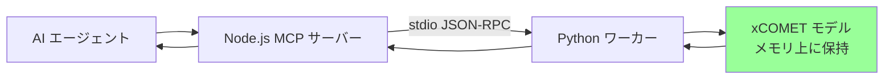
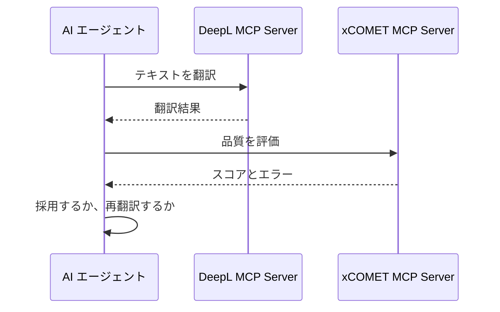
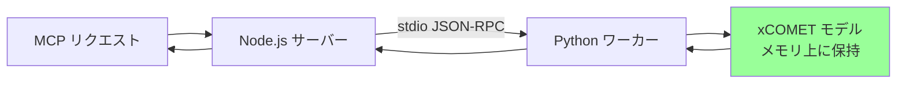

# xCOMET MCP Server

[](https://www.npmjs.com/package/xcomet-mcp-server)
[](https://github.com/shuji-bonji/xcomet-mcp-server/actions/workflows/ci.yml)
[](https://modelcontextprotocol.io)
[](https://opensource.org/licenses/MIT)

**[English README](README.md)**

> ⚠️ 本リポジトリは非公式のコミュニティプロジェクトです。Unbabel との関係はありません。

[xCOMET](https://github.com/Unbabel/COMET)（eXplainable COMET）を使って、翻訳品質を評価する MCP サーバーです。

## 概要

xCOMET MCP Server は、AI エージェントから機械翻訳の品質を評価できるようにします。Unbabel の xCOMET モデルを呼び、次のことができます。

- **品質スコア**: 0〜1 の数値で翻訳品質を評価する
- **エラー検出**: 誤り箇所を重大度（`minor` / `major` / `critical`）付きで返す
- **バッチ処理**: 複数の原文・訳文ペアをまとめて評価する（モデルの読み込みは 1 回）
- **GPU**: 任意。CUDA が使える環境では推論時間を短くできる



## 前提条件

### Python 環境

- Python 3.9〜3.12 を推奨する（3.13 以降は、xCOMET が依存するパッケージが未対応）

xCOMET は複数の Python パッケージを必要とします。仮想環境（venv）の利用を推奨します。

```bash
# uv を使う場合（推奨。指定した Python バージョンを取得する）
uv venv ~/.xcomet-venv --python 3.12
source ~/.xcomet-venv/bin/activate
uv pip install "unbabel-comet>=2.2.7,<3.0"

# 標準の venv を使う場合（Python 3.9〜3.12 が既に入っている必要がある）
python3 -m venv ~/.xcomet-venv
source ~/.xcomet-venv/bin/activate  # Windows: ~/.xcomet-venv\Scripts\activate
pip install "unbabel-comet>=2.2.7,<3.0"
```

> **Python 3.9〜3.12 に限る理由**: `unbabel-comet` は `numpy = "^1.20.0"` を
> 宣言しているため、numpy 1.x が入ります。numpy 1.x の最終版 1.26.4 の wheel は
> `cp39`〜`cp312` だけです。Python 3.13 以降では、pip は numpy を
> ソースからビルドします。

> **注記（v0.5.0 以降）**: Python ワーカーは Node.js と、stdin / stdout 上の
> 行区切り JSON-RPC で通信します。FastAPI、uvicorn、pydantic は
> 不要です。必要なパッケージは `unbabel-comet` だけです。

> **注意**: Claude Desktop など MCP ホストから起動する場合は、`XCOMET_PYTHON_PATH` に venv の Python 実行ファイルのパスを指定してください（[設定](#設定)を参照）。

### モデルのダウンロード

> **重要**: XCOMET-XL と XCOMET-XXL は Hugging Face の **gated model** です。リポジトリを開く前に、Hugging Face 側で利用承認が必要です。手順は次のとおりです。
> 1. [Hugging Face](https://huggingface.co/) アカウントを作成する
> 2. [Unbabel/XCOMET-XL](https://huggingface.co/Unbabel/XCOMET-XL) を開き、利用を申請する
> 3. 認証する。方法は次の 2 つです。
>
>    CLI でログインする:
>    ```bash
>    source ~/.xcomet-venv/bin/activate
>    hf auth login
>    ```
>    （`huggingface-cli login` も使えます。ただし huggingface_hub 0.34 以降は
>    deprecation warning を出します。現在のコマンドは `hf` です。）
>
>    または、MCP ホストの `env` に `HF_TOKEN` を置く。ホストが CLI ログイン済みでない
>    環境でサーバーを起動する場合は、こちらを使います。
>    ```json
>    "env": {
>      "XCOMET_PYTHON_PATH": "~/.xcomet-venv/bin/python3",
>      "HF_TOKEN": "hf_..."
>    }
>    ```
>    huggingface_hub は先に `HF_TOKEN` を読みます。無ければ `hf auth login` が
>    書き出したトークンファイルを読みます。
>
> `Unbabel/wmt22-comet-da` は認証が**不要**です。評価には参照訳が必須です。

認証のあと、モデルをダウンロードします（XL は約 14GB、XXL は約 42GB）。

```bash
source ~/.xcomet-venv/bin/activate
python -c "from comet import download_model; download_model('Unbabel/XCOMET-XL')"
```

#### モデルの格納位置

**venv の中には入りません。** venv に入るのは Python パッケージだけです。モデルの重みは huggingface_hub のキャッシュに入ります。このキャッシュは、Hub からモデルを取得する他のツールとも共有されます。venv とは別のディレクトリです。

```
~/.xcomet-venv/                              ← Python パッケージのみ
└── lib/python3.x/site-packages/
    ├── comet/                               unbabel-comet 本体
    └── torch/  transformers/  ...           その依存パッケージ

~/.cache/huggingface/                        ← モデルの重みはこちら
└── hub/
    └── models--Unbabel--XCOMET-XL/
        ├── blobs/                           実ファイル（約 14GB）
        └── snapshots/<revision>/
            ├── checkpoints/model.ckpt       download_model() が返すパス
            └── hparams.yaml
```

`download_model()` は `snapshot_download()` に `cache_dir=None` を渡します。格納先は huggingface_hub が決めます。`HF_HUB_CACHE` の既定は `HF_HOME/hub` です。`HF_HOME` の既定は `$XDG_CACHE_HOME/huggingface` です（`XDG_CACHE_HOME` が未設定なら `~/.cache/huggingface`）。

venv とキャッシュが別ディレクトリであることの結果は、次の 3 点です。

- venv を作り直しても削除しても、モデルを再度ダウンロードする必要はありません。
- 複数の venv と、Hub を使う他のツールが、同じコピーを共有します。
- venv ディレクトリの容量を見ても 14GB は含まれません。実使用量は `hf cache scan` で確認します。不要な revision は `hf cache delete` で削除します。

別ボリュームや共有ドライブに置きたい場合は、`XCOMET_SAVING_DIRECTORY`（v0.7.0 以降）か、標準の `HF_HOME` を設定します。どちらもダウンロード時にだけ読まれます。既定の場所にあるモデルが移動するわけではありません。新しい場所へ、改めてダウンロードされます。

### Node.js

- Node.js >= 22.0.0（`package.json` の `engines.node` と一致。CI は 22 と 24 で実行）
- npm または yarn

## インストール

> **注意**: xCOMET MCP Server を**利用するだけ**なら、このリポジトリのクローンは**不要**です。Python 環境とモデルの準備（[前提条件](#前提条件)）のあと、`npx` で起動してください（[使い方](#使い方)）。以下はコントリビューターとローカル開発向けです。

### ローカル開発

コントリビューターとローカル開発向けです。

```bash
# リポジトリをクローン
git clone https://github.com/shuji-bonji/xcomet-mcp-server.git
cd xcomet-mcp-server

# Python 仮想環境の作成と依存関係のインストール
uv venv .venv --python 3.12    # または: python3 -m venv .venv
source .venv/bin/activate
pip install -r python/requirements.txt

# Node.js 依存関係のインストールとビルド
npm install
npm run build
```

## 使い方

### Claude Desktop での利用（npx）

Claude Desktop の設定ファイル（`claude_desktop_config.json`）に追加します。

```json
{
  "mcpServers": {
    "xcomet": {
      "command": "npx",
      "args": ["-y", "xcomet-mcp-server"],
      "env": {
        "XCOMET_PYTHON_PATH": "~/.xcomet-venv/bin/python3"
      }
    }
  }
}
```

> **補足**: Python パッケージをシステム全体に入れている場合や、pyenv を使っている場合は、`XCOMET_PYTHON_PATH` を省略できます。サーバーが検出します。詳細は [Python パスの自動検出](#python-パスの自動検出) を参照してください。

### Claude Code での利用

```bash
claude mcp add xcomet --env XCOMET_PYTHON_PATH=~/.xcomet-venv/bin/python3 -- npx -y xcomet-mcp-server
```

### グローバルインストール

グローバルにインストールする場合です。

```bash
npm install -g xcomet-mcp-server
```

設定例:

```json
{
  "mcpServers": {
    "xcomet": {
      "command": "xcomet-mcp-server",
      "env": {
        "XCOMET_PYTHON_PATH": "~/.xcomet-venv/bin/python3"
      }
    }
  }
}
```

### ローカル開発ビルド

リポジトリをクローンしてビルドした場合です（[インストール（ローカル開発）](#インストールローカル開発) を参照）。

```json
{
  "mcpServers": {
    "xcomet": {
      "command": "node",
      "args": ["/path/to/xcomet-mcp-server/dist/index.js"],
      "env": {
        "XCOMET_PYTHON_PATH": "~/.xcomet-venv/bin/python3"
      }
    }
  }
}
```

## 利用可能なツール

### `xcomet_evaluate`

原文と訳文の 1 ペアについて、翻訳品質を評価します。

**引数:**

| 名前 | 型 | 必須 | 説明 |
|------|------|----------|-------------|
| `source` | string | ✅ | 原文 |
| `translation` | string | ✅ | 評価する訳文 |
| `reference` | string | ❌ | 参照訳（任意） |
| `source_lang` | string | ❌ | 原文の言語コード（ISO 639-1） |
| `target_lang` | string | ❌ | 訳文の言語コード（ISO 639-1） |
| `response_format` | `"json"` \| `"markdown"` | ❌ | 出力形式（既定: `"json"`） |
| `use_gpu` | boolean | ❌ | GPU で推論する（既定: `false`） |

**入力例:**

```json
{
  "source": "The quick brown fox jumps over the lazy dog.",
  "translation": "素早い茶色のキツネが怠惰な犬を飛び越える。",
  "source_lang": "en",
  "target_lang": "ja",
  "use_gpu": true
}
```

**応答例:**

```json
{
  "score": 0.847,
  "errors": [],
  "summary": "Good quality (score: 0.847) with 0 error(s) detected."
}
```

### `xcomet_detect_errors`

翻訳の誤り箇所の検出と分類に使います。

**引数:**

| 名前 | 型 | 必須 | 説明 |
|------|------|----------|-------------|
| `source` | string | ✅ | 原文 |
| `translation` | string | ✅ | 分析する訳文 |
| `reference` | string | ❌ | 参照訳 |
| `min_severity` | `"minor"` \| `"major"` \| `"critical"` | ❌ | 返す重大度の下限（既定: `"minor"`） |
| `response_format` | `"json"` \| `"markdown"` | ❌ | 出力形式 |
| `use_gpu` | boolean | ❌ | GPU で推論する（既定: `false`） |

### `xcomet_batch_evaluate`

複数の原文・訳文ペアを 1 回の呼び出しで評価します。

> **処理時間**: v0.3.0 以降、Python ワーカーは終了せず動き続け、モデルはメモリ上に残ります。バッチ評価は、モデルを再度読み込まずに全ペアを処理します。

**引数:**

| 名前 | 型 | 必須 | 説明 |
|------|------|----------|-------------|
| `pairs` | array | ✅ | `{source, translation, reference?}` の配列（最大 500） |
| `source_lang` | string | ❌ | 原文の言語コード |
| `target_lang` | string | ❌ | 訳文の言語コード |
| `response_format` | `"json"` \| `"markdown"` | ❌ | 出力形式 |
| `use_gpu` | boolean | ❌ | GPU で推論する（既定: `false`） |
| `batch_size` | number | ❌ | バッチサイズ 1〜64（既定: 8）。大きいほど速いが、メモリ使用量は増える |

**入力例:**

```json
{
  "pairs": [
    {"source": "Hello", "translation": "こんにちは"},
    {"source": "Goodbye", "translation": "さようなら"}
  ],
  "use_gpu": true,
  "batch_size": 16
}
```

## 他の MCP サーバーとの併用

翻訳の実行と品質評価を分ける場合、他の MCP サーバーと一緒に使えます。



### 推奨する手順

1. DeepL MCP Server で**翻訳する**
2. xCOMET MCP Server で**評価する**
3. 品質が閾値を下回ったら**再翻訳する**

### 設定例: DeepL と xCOMET

Claude Desktop で両方を設定する例です。

```json
{
  "mcpServers": {
    "deepl": {
      "command": "npx",
      "args": ["-y", "@anthropic/deepl-mcp-server"],
      "env": {
        "DEEPL_API_KEY": "your-api-key"
      }
    },
    "xcomet": {
      "command": "npx",
      "args": ["-y", "xcomet-mcp-server"],
      "env": {
        "XCOMET_PYTHON_PATH": "~/.xcomet-venv/bin/python3"
      }
    }
  }
}
```

Claude への指示例:

> 「このテキストを DeepL で日本語に翻訳し、xCOMET で品質を評価してください。スコアが 0.8 未満なら改善案を提案してください。」

## 設定

### 環境変数

| 変数 | 既定値 | 説明 |
|----------|---------|-------------|
| `XCOMET_MODEL` | `Unbabel/XCOMET-XL` | 使用する xCOMET モデル |
| `XCOMET_PYTHON_PATH` | （自動検出） | Python 実行ファイルのパス（後述） |
| `XCOMET_PRELOAD` | `false` | 起動時にモデルを読み込む（v0.3.1 以降） |
| `XCOMET_DEBUG` | `false` | 詳細なデバッグログを出す（v0.3.1 以降） |
| `XCOMET_NUM_WORKERS` | `1` | `model.predict()` の DataLoader ワーカー数（v0.6.0 以降）。大きなバッチを GPU で処理し、CPU コアに余裕があるときは増やすとスループットが上がります。不正な値は `1` として扱います。 |
| `XCOMET_SAVING_DIRECTORY` | （Hugging Face のキャッシュ） | チェックポイントのダウンロード先（v0.7.0 以降）。未設定なら huggingface_hub のキャッシュ（`HF_HOME`、既定は `~/.cache/huggingface`）に入ります。XL は 14GB、XXL は 43GB あるため、別ボリュームに置きたい場合に指定します。 |
| `XCOMET_LOCAL_FILES_ONLY` | `false` | チェックポイントをローカルキャッシュだけから解決する（v0.7.0 以降）。`true` にするとネットワークなしで起動します。モデルは事前にダウンロード済みである必要があります。 |
| `HF_TOKEN` | （未設定） | huggingface_hub が読む Hugging Face のアクセストークン。gated model（XCOMET-XL、XCOMET-XXL、CometKiwi 系）で、`hf auth login` の代わりに使えます。 |

### モデルの選択

品質と実行環境に合わせて選びます。

| モデル | パラメータ数 | サイズ | メモリ | 参照訳 | HF 認証 | 品質 | 用途 |
|-------|------------|------|--------|-----------|---------|---------|----------|
| `Unbabel/XCOMET-XL` | 3.5B | 約 14GB | 約 8〜10GB | 任意 | ✅ 必要 | ⭐⭐⭐⭐ | 多くの用途で推奨 |
| `Unbabel/XCOMET-XXL` | 10.7B | 約 42GB | 約 20GB | 任意 | ✅ 必要 | ⭐⭐⭐⭐⭐ | 品質優先。必要なメモリとディスクが多い |
| `Unbabel/wmt22-comet-da` | 580M | 約 2GB | 約 3GB | **必須** | 不要 | ⭐⭐⭐ | 軽量。読み込みが速い |

> **重要**: XCOMET-XL と XCOMET-XXL は Hugging Face の gated model です。モデルごとに**別々の**利用承認が必要です。認証手順は [モデルのダウンロード](#モデルのダウンロード) を参照してください。

> **重要**: `wmt22-comet-da` は評価に `reference`（参照訳）が**必須**です。XCOMET モデルは参照訳なしの評価ができます。

> **補足**: メモリ不足やモデル読み込みの遅さが問題になる場合は、`Unbabel/wmt22-comet-da` を使うと処理は速くなります。精度は下がります。参照訳の指定を忘れないでください。

**別のモデルを使う場合**は、`XCOMET_MODEL` を設定します。

```json
{
  "mcpServers": {
    "xcomet": {
      "command": "npx",
      "args": ["-y", "xcomet-mcp-server"],
      "env": {
        "XCOMET_MODEL": "Unbabel/XCOMET-XXL"
      }
    }
  }
}
```

### Python パスの自動検出

サーバーは、`unbabel-comet` が入っている Python 環境を次の順で探します。

1. **`XCOMET_PYTHON_PATH`** 環境変数（設定されている場合）
2. **pyenv**（`~/.pyenv/versions/*/bin/python3`）。`comet` モジュールの有無を確認する
3. **Homebrew** の Python（`/opt/homebrew/bin/python3`、`/usr/local/bin/python3`）
4. **最後の候補**: `python3` コマンド

MCP ホスト（例: Claude Desktop）がターミナルとは別の Python を使う場合でも、この順で解決します。

**例: Python パスを明示する**

```json
{
  "mcpServers": {
    "xcomet": {
      "command": "npx",
      "args": ["-y", "xcomet-mcp-server"],
      "env": {
        "XCOMET_PYTHON_PATH": "/Users/you/.pyenv/versions/3.11.0/bin/python3"
      }
    }
  }
}
```

## パフォーマンス

### 常駐 Python ワーカー（v0.3.0 以降。v0.5.0 から通信は stdio）

サーバーは、xCOMET モデルをメモリ上に載せたままにする **常駐 Python ワーカー** を使います。Node.js の MCP サーバーは、そのワーカーと stdin / stdout 上の行区切り JSON-RPC で通信します。ローカル HTTP リスナー、ポートのバインド、FastAPI は使いません。

| リクエスト | 時間 | 備考 |
|---------|------|-------|
| 初回 | 約 25〜90 秒 | モデルの読み込み（モデルサイズによる） |
| 2 回目以降 | **約 500ms** | モデルは読み込み済み |

毎回モデルを読み直す場合と比べ、連続評価では約 **177 倍** 速くなります。

### 起動時の事前読み込み（v0.3.1 以降）

`XCOMET_PRELOAD=true` を付けると、サーバー起動時にモデルを読み込みます。

```json
{
  "mcpServers": {
    "xcomet": {
      "command": "npx",
      "args": ["-y", "xcomet-mcp-server"],
      "env": {
        "XCOMET_PRELOAD": "true"
      }
    }
  }
}
```

事前読み込みを有効にすると、初回を含む**すべてのリクエスト**が約 500ms になります。



### バッチ処理

`xcomet_batch_evaluate` は、モデルの読み込み 1 回で全ペアを処理します。

| ペア数 | 目安時間 |
|-------|----------------|
| 10 | 約 30〜40 秒 |
| 50 | 約 1〜1.5 分 |
| 100 | 約 2 分 |

### GPU と CPU

| モード | 100 ペア（目安） |
|------|----------------------|
| CPU（`batch_size=8`） | 約 2 分 |
| GPU（`batch_size=16`） | 約 20〜30 秒 |

> **注意**: GPU には CUDA 対応ハードウェアと、CUDA 対応の PyTorch が必要です。GPU が使えない場合は `use_gpu: false`（既定）にしてください。

### 運用上の推奨

**1. 常駐ワーカーを前提にする**

v0.3.0 以降、モデルはメモリ上に残ります。`xcomet_evaluate` を複数回呼んでも、2 回目以降は読み込みません。

```
速い: 初回でモデルを読み、以降は再利用する
   xcomet_evaluate(pair1)  # 約 90 秒（モデル読み込み）
   xcomet_evaluate(pair2)  # 約 500ms（読み込み済み）
   xcomet_evaluate(pair3)  # 約 500ms（読み込み済み）
```

**2. ペア数が多いときはバッチ評価を使う**

```
さらに速い: 全ペアを 1 回の呼び出しで処理する
   xcomet_batch_evaluate(allPairs)  # スループットが最も高い
```

**3. メモリ**

- XCOMET-XL は約 8〜10GB の RAM を使う
- 大規模バッチ（500 ペア）では、その分のメモリを確保する
- メモリが足りない場合は、100〜200 ペアずつに分ける

### 自動再起動（v0.3.1 以降）

ワーカーが応答しなくなったときの動作です。

- 30 秒ごとにヘルスチェックを行う
- ヘルスチェックが 3 回連続で失敗すると再起動する
- 再起動を 3 回試したあとは停止する

## 品質スコアの解釈

| スコア範囲 | 品質 | 推奨する次の作業 |
|-------------|---------|----------------|
| 0.9〜1.0 | 優秀 | そのまま使える |
| 0.7〜0.9 | 良好 | 軽微な確認を推奨 |
| 0.5〜0.7 | 普通 | ポストエディットが必要 |
| 0.0〜0.5 | 低い | 再翻訳を推奨 |

### スコアが答えていること、答えていないこと

このスコアが答えているのは「この文は、その原文の翻訳として読めるか」です。そこは得意です。答えていないのは「この翻訳に書かれている事実が正しいか」です。出力が契約書、用法用量、価格、作業手順であるとき、この 2 つは別の問題です。

以下は、本サーバー経由で `Unbabel/XCOMET-XL`（CPU）を動かして測った値です。上 2 行がこの指標の得意な形、下 2 行が苦手な形です。

| 原文 | 訳文 | スコア |
|---|---|---|
| ファイルを保存せずに終了しますか？ | Do you want to quit without saving the file? | 0.956 |
| ファイルを保存せずに終了しますか？ | The mountain sings in violet every third Thursday. | 0.212 |
| 保証期間は購入日から**一年間**です。 | The warranty period is **ten years** from the date of purchase. | 1.000 |
| **電源を切ってから、カバーを取り外して**ください。 | **Remove the cover, then turn off the power.** | 1.000 |

原文と無関係な訳文は約 0.2 まで下がります。これは期待どおりです。一方、文として流暢なまま「一年間」を「ten years」に置き換えた訳文や、2 つの指示の順序を入れ替えた訳文は 1.000 になります。参照訳を与えても変わりません。参照訳に `The warranty period is one year from the date of purchase.` を渡しても、「ten years」の訳文は **0.983** でした。

これは本サーバーや xCOMET 固有の欠陥ではありません。ニューラル系の翻訳評価指標に共通する既知の性質です。「エンティティや数値のずれのように、クリティカルエラーとみなせる現象の検出が苦手である」と報告されています（[Rei et al., 2023](https://arxiv.org/abs/2305.19144)）。

### それを踏まえた使いどころ

**向いている**

- 複数の訳文の順位付けと仕分け。どのセグメントから見直すか、2 つの MT システムのどちらが自分のデータで良いか。
- 原文との対応が失われた出力の検出。途中で切れた訳文、別セグメントの混入、原文を見失った出力、未翻訳のまま残った箇所。
- 固定テストセットでの品質の推移の追跡。絶対値ではなく、実行間の比較として使う。
- 人手レビューの前段フィルタ。人の時間をどこに割くかを決める用途。

**向いていない**

- 数値や固有名詞の取り違えが 1 つあれば不合格になる領域（医療、法務、金融、安全手順）で、このスコアだけをリリース可否の判定に使うこと。数値、日付、単位、通貨、固有名詞は、実際に突き合わせる規則で別途確認してください。スコアは代わりになりません。
- 絶対的な品質の主張。0.95 は「95% 正しい」ではありません。モデル間、言語ペア間、セグメント長の異なるもの同士で比較できる値でもありません。
- 極端に短いセグメント（UI ラベル、単語 1 つ）。スコアの上限付近に寄り、差が付かなくなります。

**`xcomet_detect_errors` をスコアと併用してください。** エラースパンは、モデルが「どこが」おかしいと判断したかを、MQM の重大度付きで示します。高いスコアと `critical` のスパンが同時に出ている状態は、どちらか一方の数値だけを見るより判断材料になります。

## トラブルシューティング

### よくある問題

#### `No module named 'comet'`

**原因**: `unbabel-comet` が入っていない Python 環境を使っている。

**対処**:

```bash
# 使用されている Python を確認
python3 -c "import sys; print(sys.executable)"

# 仮想環境を使っている場合は、有効化されているか確認
source .venv/bin/activate
pip install -r python/requirements.txt

# MCP ホスト（例: Claude Desktop）では venv の Python パスを指定
export XCOMET_PYTHON_PATH=~/.xcomet-venv/bin/python3
```

#### Homebrew の更新後に venv が動かなくなった

**症状**: `zsh: no such file or directory: .venv/bin/python3`。activate したのに `python3` が venv 以外の interpreter を指す。昨日まで動いていた venv で `No module named 'comet'` が出る。

**原因**: venv は interpreter 本体を持ちません。作成元への絶対パスのシンボリックリンクを持ちます。記録は `pyvenv.cfg` にあります。

```
home = /opt/homebrew/opt/python@3.14/bin
version = 3.14.3
```

Homebrew がその formula を更新または削除すると、リンク先が無くなり、venv は実行できなくなります。`lib/python3.x/site-packages/` は残りますが、実行する手段がありません。

**確認**:

```bash
ls -l .venv/bin/python3 && .venv/bin/python3 -V
cat .venv/pyvenv.cfg
```

**対処**: 作り直します。`uv venv --python 3.12` の方が、Homebrew 更新後もリンク先が残りやすいです。uv はその interpreter を自分で取得して固定するため、Homebrew の現在の Python を借りません。

```bash
rm -rf .venv
uv venv .venv --python 3.12
source .venv/bin/activate
uv pip install "unbabel-comet>=2.2.7,<3.0"
```

パッケージの再インストールで数百 MB かかります。**モデルは再ダウンロードされません。** チェックポイントは venv ではなく huggingface_hub のキャッシュにあります（[モデルの格納位置](#モデルの格納位置) を参照）。

#### モデルのダウンロードが失敗する、またはタイムアウトする

**原因**: 大きなモデルファイル（XL は約 14GB）には安定した通信が必要です。XCOMET モデルは Hugging Face 認証も必要です（[モデルのダウンロード](#モデルのダウンロード) を参照）。

**対処**:

```bash
# Hugging Face で認証する（XCOMET-XL / XXL に必要）
hf auth login          # または: export HF_TOKEN=hf_...

# モデルを手動で事前ダウンロードする
python -c "from comet import download_model; download_model('Unbabel/XCOMET-XL')"
```

ダウンロードが途中で止まった場合、キャッシュには `checkpoints/model.ckpt` を含まない snapshot ディレクトリが残ります。サーバーはそのパスを示して削除を促します。場所は `hf cache scan` で確認できます。

#### GPU が検出されない

**原因**: CUDA 対応の PyTorch が入っていない。

**対処**:

```bash
# CUDA が使えるか確認
python -c "import torch; print(torch.cuda.is_available())"

# False の場合、CUDA 付き PyTorch を入れ直す
pip install torch --index-url https://download.pytorch.org/whl/cu118
```

#### Mac での処理が遅い（MPS）

**原因**: Mac MPS（Metal Performance Shaders）は、一部の操作と互換性がありません。

**対処**: サーバーは Mac MPS 向けに `num_workers=1` を使います。Mac で処理時間を短くするには、CPU モード（`use_gpu: false`）を使ってください。

#### メモリ使用量が高い、またはプロセスが落ちる

**原因**: XCOMET-XL は約 8〜10GB の RAM を使います。

**対処**:

1. **常駐ワーカーを使う**（v0.3.0 以降）: モデルは 1 回読み込まれ、メモリ上に残ります。呼び出しのたびにメモリ使用量が急増することを避けられます。
2. **軽いモデルを使う**: メモリを抑えるなら `XCOMET_MODEL=Unbabel/wmt22-comet-da` を設定する（約 3GB）。
3. **バッチサイズを小さくする**: 大規模バッチは 100〜200 ペアずつに分ける。
4. **他のアプリケーションを閉じる**: 大規模評価の前に RAM を空ける。

```bash
# 利用可能なメモリを確認
free -h  # Linux
vm_stat | head -5  # macOS
```

#### VS Code や IDE が評価中に落ちる

**原因**: xCOMET モデルのメモリ使用量が高い（XL は約 8〜10GB）。

**対処**:

- v0.3.0 以降、モデルは 1 回読み込まれ、メモリ上に残ります（繰り返し読み込みません）。
- それでもメモリが足りない場合は、軽いモデルを使う: `XCOMET_MODEL=Unbabel/wmt22-comet-da`
- 評価前に、メモリを多く使う他のアプリケーションを閉じる

### 問い合わせ

問題が起きた場合の手順です。

1. [GitHub Issues](https://github.com/shuji-bonji/xcomet-mcp-server/issues) を確認する
2. デバッグログを有効にして確認する（Claude Desktop の開発者モードログ、または `XCOMET_DEBUG=true`）
3. 次の情報を付けて新しい Issue を作成する
   - OS と Python バージョン
   - エラーメッセージ
   - 設定（機密データを除く）

## 開発

```bash
# 依存関係をインストール
npm install

# TypeScript をビルド
npm run build

# ウォッチモード
npm run dev

# テストを実行（Vitest）
npm test

# Python 側のテストを実行（pytest だけで動く。comet もモデルも不要）
npm run test:python

# MCP Inspector で確認
npm run inspect
```

`npm run test:python` は `python3 -m pytest` を呼びます。PATH 上の `python3` から pytest を import できる必要があります。xCOMET 用の venv を activate しても、その venv に pytest が入っていなければ同じです。次のいずれかで入れてください。

```bash
uvx pytest tests/test_server.py -q                    # インストール不要
~/.xcomet-venv/bin/python -m pip install pytest       # xCOMET の venv に入れる
python3 -m venv .venv-dev && .venv-dev/bin/pip install pytest
```

各テストスイートの対象は [tests/README.md](tests/README.md) に書いてあります。

## 変更履歴

バージョン履歴と更新内容は [CHANGELOG.md](CHANGELOG.md) を参照してください。

## ライセンス

MIT License。詳細は [LICENSE](LICENSE) を参照してください。

## 謝辞

- [Unbabel](https://unbabel.com/) — xCOMET モデル
- [Anthropic](https://anthropic.com/) — MCP プロトコル
- [Model Context Protocol](https://modelcontextprotocol.io/) コミュニティ

## 参考文献

- [xCOMET 論文](https://direct.mit.edu/tacl/article/doi/10.1162/tacl_a_00683/124263/xcomet-Transparent-Machine-Translation-Evaluation)
- [COMET フレームワーク](https://github.com/Unbabel/COMET)
- [BLEU Meets COMET (Rei et al., 2023)](https://arxiv.org/abs/2305.19144) — ニューラル指標がエンティティ・数値の誤りを見落とすことについて。[スコアが答えていること、答えていないこと](#スコアが答えていること答えていないこと) の根拠
- [Hugging Face Hub のキャッシュ構造](https://huggingface.co/docs/huggingface_hub/guides/manage-cache)
- [MCP 仕様](https://spec.modelcontextprotocol.io/)
