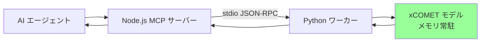
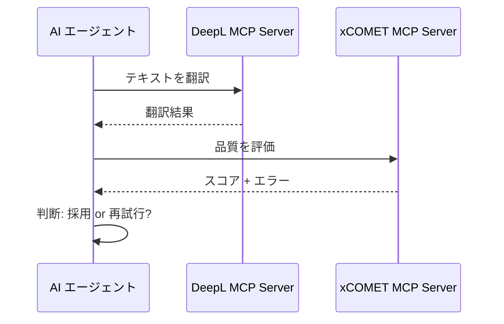
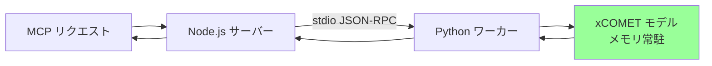

# xCOMET MCP Server

[](https://www.npmjs.com/package/xcomet-mcp-server)
[](https://github.com/shuji-bonji/xcomet-mcp-server/actions/workflows/ci.yml)
[](https://modelcontextprotocol.io)
[](https://opensource.org/licenses/MIT)

**[English README](README.md)**

> ⚠️ これは非公式のコミュニティプロジェクトであり、Unbabel とは関係ありません。

[xCOMET](https://github.com/Unbabel/COMET)（eXplainable COMET）を使用した翻訳品質評価 MCP サーバーです。

## 概要

xCOMET MCP Server は、AI エージェントに機械翻訳の品質評価機能を提供します。Unbabel の xCOMET モデルと統合し、以下の機能を提供します：

- **品質スコアリング**: 0〜1 のスコアで翻訳品質を評価
- **エラー検出**: エラー箇所を重大度（minor/major/critical）付きで特定
- **バッチ処理**: 複数の翻訳ペアを効率的に評価（モデルの単一ロード最適化）
- **GPU サポート**: 高速推論のためのオプション GPU アクセラレーション



## 前提条件

### Python 環境

- Python 3.9 - 3.12 推奨（3.13 以降は xCOMET の依存パッケージが未対応）

xCOMET には複数の Python パッケージが必要です。仮想環境（venv）の利用を推奨します：

```bash
# uv を使う場合（推奨 — 適切な Python バージョンを自動ダウンロード）
uv venv ~/.xcomet-venv --python 3.12
source ~/.xcomet-venv/bin/activate
uv pip install "unbabel-comet>=2.2.0"

# 標準の venv を使う場合（Python 3.9-3.12 が既にインストールされている必要あり）
python3 -m venv ~/.xcomet-venv
source ~/.xcomet-venv/bin/activate  # Windows: ~/.xcomet-venv\Scripts\activate
pip install "unbabel-comet>=2.2.0"
```

> **Note (v0.5.0+)**: Python ワーカーは Node.js と stdin/stdout 上の
> 行区切り JSON-RPC で通信します。FastAPI / uvicorn / pydantic は
> 不要になりました（必要なのは `unbabel-comet` のみ）。

> **注意**: Claude Desktop 等の MCP ホストから利用する場合は、`XCOMET_PYTHON_PATH` に venv の Python パスを指定してください（[設定](#設定)を参照）。

### モデルのダウンロード

> **重要**: XCOMET-XL と XCOMET-XXL は HuggingFace の**ゲート付きモデル**です。以下の手順が必要です：
> 1. [HuggingFace](https://huggingface.co/) アカウントを作成
> 2. [Unbabel/XCOMET-XL](https://huggingface.co/Unbabel/XCOMET-XL) にアクセスし、利用をリクエスト
> 3. CLI でログイン：
>    ```bash
>    source ~/.xcomet-venv/bin/activate
>    huggingface-cli login
>    ```
>
> `Unbabel/wmt22-comet-da` は認証**不要**です（ただし参照訳が必須）。

認証後、モデルをダウンロードします（XL は約 14GB、XXL は約 42GB）：

```bash
source ~/.xcomet-venv/bin/activate
python -c "from comet import download_model; download_model('Unbabel/XCOMET-XL')"
```

### Node.js

- Node.js >= 22.0.0（`package.json` の `engines.node` と一致。CI は 22 と 24 で実行）
- npm または yarn

## インストール

> **注意**: xCOMET MCP Server を**利用するだけ**であれば、このリポジトリのクローンは**不要**です。Python 環境とモデルのセットアップ（[前提条件](#前提条件)を参照）を行い、`npx` で利用してください（[使い方](#使い方)を参照）。以下のセクションはコントリビューターやローカル開発向けです。

### ローカル開発

コントリビューターやローカル開発向け：

```bash
# リポジトリをクローン
git clone https://github.com/shuji-bonji/xcomet-mcp-server.git
cd xcomet-mcp-server

# Python 仮想環境のセットアップと依存関係のインストール
uv venv .venv --python 3.12    # または: python3 -m venv .venv
source .venv/bin/activate
pip install -r python/requirements.txt

# Node.js 依存関係のインストールとビルド
npm install
npm run build
```

## 使い方

### Claude Desktop での利用（npx）

Claude Desktop の設定ファイル（`claude_desktop_config.json`）に追加：

```json
{
  "mcpServers": {
    "xcomet": {
      "command": "npx",
      "args": ["-y", "xcomet-mcp-server"],
      "env": {
        "XCOMET_PYTHON_PATH": "~/.xcomet-venv/bin/python3"
      }
    }
  }
}
```

> **ヒント**: Python パッケージをシステム全体にインストールしている場合や pyenv を使用している場合は、`XCOMET_PYTHON_PATH` を省略できます（自動検出されます）。詳細は [Python パスの自動検出](#python-パスの自動検出) を参照してください。

### Claude Code での利用

```bash
claude mcp add xcomet --env XCOMET_PYTHON_PATH=~/.xcomet-venv/bin/python3 -- npx -y xcomet-mcp-server
```

### グローバルインストール

グローバルにインストールする場合：

```bash
npm install -g xcomet-mcp-server
```

設定：
```json
{
  "mcpServers": {
    "xcomet": {
      "command": "xcomet-mcp-server",
      "env": {
        "XCOMET_PYTHON_PATH": "~/.xcomet-venv/bin/python3"
      }
    }
  }
}
```

### ローカル開発ビルド

リポジトリをクローンしてビルドした場合（[インストール（ローカル開発）](#インストールローカル開発)を参照）：

```json
{
  "mcpServers": {
    "xcomet": {
      "command": "node",
      "args": ["/path/to/xcomet-mcp-server/dist/index.js"],
      "env": {
        "XCOMET_PYTHON_PATH": "~/.xcomet-venv/bin/python3"
      }
    }
  }
}
```

## 利用可能なツール

### `xcomet_evaluate`

単一の原文・訳文ペアの翻訳品質を評価します。

**パラメータ:**
| 名前 | 型 | 必須 | 説明 |
|------|------|----------|-------------|
| `source` | string | ✅ | 原文テキスト |
| `translation` | string | ✅ | 評価対象の訳文 |
| `reference` | string | ❌ | 参照訳（オプション） |
| `source_lang` | string | ❌ | 原文の言語コード（ISO 639-1） |
| `target_lang` | string | ❌ | 訳文の言語コード（ISO 639-1） |
| `response_format` | "json" \| "markdown" | ❌ | 出力形式（デフォルト: "json"） |
| `use_gpu` | boolean | ❌ | GPU 推論を使用（デフォルト: false） |

**例:**
```json
{
  "source": "The quick brown fox jumps over the lazy dog.",
  "translation": "素早い茶色のキツネが怠惰な犬を飛び越える。",
  "source_lang": "en",
  "target_lang": "ja",
  "use_gpu": true
}
```

**レスポンス:**
```json
{
  "score": 0.847,
  "errors": [],
  "summary": "Good quality (score: 0.847) with 0 error(s) detected."
}
```

### `xcomet_detect_errors`

翻訳エラーの検出と分類に特化したツールです。

**パラメータ:**
| 名前 | 型 | 必須 | 説明 |
|------|------|----------|-------------|
| `source` | string | ✅ | 原文テキスト |
| `translation` | string | ✅ | 分析対象の訳文 |
| `reference` | string | ❌ | 参照訳 |
| `min_severity` | "minor" \| "major" \| "critical" | ❌ | 最小重大度（デフォルト: "minor"） |
| `response_format` | "json" \| "markdown" | ❌ | 出力形式 |
| `use_gpu` | boolean | ❌ | GPU 推論を使用（デフォルト: false） |

### `xcomet_batch_evaluate`

複数の翻訳ペアを一括評価します。

> **パフォーマンスノート**: 永続サーバーアーキテクチャ（v0.3.0+）により、モデルはメモリに常駐します。バッチ評価は、モデルを再ロードすることなくすべてのペアを効率的に処理します。

**パラメータ:**
| 名前 | 型 | 必須 | 説明 |
|------|------|----------|-------------|
| `pairs` | array | ✅ | {source, translation, reference?} の配列（最大 500） |
| `source_lang` | string | ❌ | 原文の言語コード |
| `target_lang` | string | ❌ | 訳文の言語コード |
| `response_format` | "json" \| "markdown" | ❌ | 出力形式 |
| `use_gpu` | boolean | ❌ | GPU 推論を使用（デフォルト: false） |
| `batch_size` | number | ❌ | バッチサイズ 1-64（デフォルト: 8）。大きいほど高速だがメモリ使用量増加 |

**例:**
```json
{
  "pairs": [
    {"source": "Hello", "translation": "こんにちは"},
    {"source": "Goodbye", "translation": "さようなら"}
  ],
  "use_gpu": true,
  "batch_size": 16
}
```

## 他の MCP サーバーとの連携

xCOMET MCP Server は、完全な翻訳ワークフローのために他の MCP サーバーと連携するように設計されています：



### 推奨ワークフロー

1. DeepL MCP Server で**翻訳**
2. xCOMET MCP Server で**評価**
3. 品質が閾値以下なら**再試行**

### 設定例: DeepL + xCOMET 連携

Claude Desktop で両サーバーを設定：

```json
{
  "mcpServers": {
    "deepl": {
      "command": "npx",
      "args": ["-y", "@anthropic/deepl-mcp-server"],
      "env": {
        "DEEPL_API_KEY": "your-api-key"
      }
    },
    "xcomet": {
      "command": "npx",
      "args": ["-y", "xcomet-mcp-server"],
      "env": {
        "XCOMET_PYTHON_PATH": "~/.xcomet-venv/bin/python3"
      }
    }
  }
}
```

Claude への指示例：
> 「このテキストを DeepL で日本語に翻訳し、xCOMET で品質を評価してください。スコアが 0.8 未満なら改善案を提案してください。」

## 設定

### 環境変数

| 変数 | デフォルト | 説明 |
|----------|---------|-------------|
| `XCOMET_MODEL` | `Unbabel/XCOMET-XL` | 使用する xCOMET モデル |
| `XCOMET_PYTHON_PATH` | （自動検出） | Python 実行ファイルのパス（下記参照） |
| `XCOMET_PRELOAD` | `false` | 起動時にモデルをプリロード（v0.3.1+） |
| `XCOMET_DEBUG` | `false` | 詳細デバッグログを有効化（v0.3.1+） |
| `XCOMET_NUM_WORKERS` | `1` | `model.predict()` 用 DataLoader ワーカー数（v0.6.0+）。大きなバッチで GPU を回す際、CPU コアに余裕があれば増やすとスループットが改善。不正な値は `1` にフォールバック。 |

### モデル選択

品質とパフォーマンスのニーズに応じてモデルを選択：

| モデル | パラメータ | サイズ | メモリ | 参照訳 | HF 認証 | 品質 | 用途 |
|-------|------------|------|--------|-----------|---------|---------|----------|
| `Unbabel/XCOMET-XL` | 3.5B | 約 14GB | 約 8-10GB | 任意 | ✅ 必要 | ⭐⭐⭐⭐ | ほとんどの用途に推奨 |
| `Unbabel/XCOMET-XXL` | 10.7B | 約 42GB | 約 20GB | 任意 | ✅ 必要 | ⭐⭐⭐⭐⭐ | 最高品質、より多くのリソースが必要 |
| `Unbabel/wmt22-comet-da` | 580M | 約 2GB | 約 3GB | **必須** | 不要 | ⭐⭐⭐ | 軽量、高速ロード |

> **重要**: XCOMET-XL と XCOMET-XXL は HuggingFace のゲート付きモデルです。各モデルごとに**個別の**アクセス承認が必要です。認証手順は[モデルのダウンロード](#モデルのダウンロード)を参照してください。

> **重要**: `wmt22-comet-da` は評価に `reference`（参照訳）が**必須**です。XCOMET モデルは参照訳なしの評価をサポートしています。

> **ヒント**: メモリ不足やモデルロードが遅い場合は、`Unbabel/wmt22-comet-da` を使用すると、精度は若干低下しますがパフォーマンスが向上します（ただし参照訳の提供を忘れずに）。

**別のモデルを使用する場合**、`XCOMET_MODEL` 環境変数を設定：

```json
{
  "mcpServers": {
    "xcomet": {
      "command": "npx",
      "args": ["-y", "xcomet-mcp-server"],
      "env": {
        "XCOMET_MODEL": "Unbabel/XCOMET-XXL"
      }
    }
  }
}
```

### Python パスの自動検出

サーバーは `unbabel-comet` がインストールされた Python 環境を自動検出します：

1. **`XCOMET_PYTHON_PATH`** 環境変数（設定されている場合）
2. **pyenv** バージョン（`~/.pyenv/versions/*/bin/python3`）- `comet` モジュールをチェック
3. **Homebrew** Python（`/opt/homebrew/bin/python3`、`/usr/local/bin/python3`）
4. **フォールバック**: `python3` コマンド

これにより、MCP ホスト（例: Claude Desktop）がターミナルとは異なる Python を使用している場合でも、サーバーが正しく動作します。

**例: 明示的な Python パス設定**
```json
{
  "mcpServers": {
    "xcomet": {
      "command": "npx",
      "args": ["-y", "xcomet-mcp-server"],
      "env": {
        "XCOMET_PYTHON_PATH": "/Users/you/.pyenv/versions/3.11.0/bin/python3"
      }
    }
  }
}
```

## パフォーマンス

### 永続ワーカーアーキテクチャ（v0.3.0+, v0.5.0 から stdio）

サーバーは xCOMET モデルをメモリに保持する**永続 Python ワーカー**を使用します。
Node.js の MCP サーバーはワーカーと stdin/stdout 上の行区切り JSON-RPC で
通信するため、ローカル HTTP リスナーもポートバインドも FastAPI も不要です。

| リクエスト | 時間 | 備考 |
|---------|------|-------|
| 初回リクエスト | 約 25-90 秒 | モデルロード（モデルサイズによる） |
| 2 回目以降 | **約 500ms** | モデルはロード済み |

これにより、毎回モデルを再ロードする場合と比較して、連続評価で**177 倍の高速化**を実現します。

### 即時ロード（v0.3.1+）

`XCOMET_PRELOAD=true` を有効にすると、サーバー起動時にモデルをプリロードします：

```json
{
  "mcpServers": {
    "xcomet": {
      "command": "npx",
      "args": ["-y", "xcomet-mcp-server"],
      "env": {
        "XCOMET_PRELOAD": "true"
      }
    }
  }
}
```

プリロードを有効にすると、初回リクエストを含む**すべてのリクエストが高速**（約 500ms）になります。



### バッチ処理の最適化

`xcomet_batch_evaluate` ツールは、単一のモデルロードですべてのペアを処理します：

| ペア数 | 推定時間 |
|-------|----------------|
| 10 | 約 30-40 秒 |
| 50 | 約 1-1.5 分 |
| 100 | 約 2 分 |

### GPU vs CPU パフォーマンス

| モード | 100 ペア（推定） |
|------|----------------------|
| CPU (batch_size=8) | 約 2 分 |
| GPU (batch_size=16) | 約 20-30 秒 |

> **注意**: GPU には CUDA 対応ハードウェアと CUDA サポート付き PyTorch が必要です。GPU が利用できない場合は、`use_gpu: false`（デフォルト）を設定してください。

### ベストプラクティス

**1. 永続サーバーを活用する**

v0.3.0+ では、モデルはメモリに常駐します。複数の `xcomet_evaluate` 呼び出しも効率的です：

```
✅ 高速: 初回呼び出しでモデルをロード、以降は再利用
   xcomet_evaluate(pair1)  # 約 90 秒（モデルロード）
   xcomet_evaluate(pair2)  # 約 500ms（モデルキャッシュ済み）
   xcomet_evaluate(pair3)  # 約 500ms（モデルキャッシュ済み）
```

**2. 多数のペアにはバッチ評価を使用**

```
✅ さらに高速: すべてのペアを一度に処理
   xcomet_batch_evaluate(allPairs)  # 最適なスループット
```

**3. メモリに関する考慮事項**

- XCOMET-XL は約 8-10GB の RAM が必要
- 大規模バッチ（500 ペア）では十分なメモリを確保
- メモリが限られている場合は、より小さなバッチ（100-200 ペア）に分割

### 自動再起動（v0.3.1+）

サーバーは障害から自動的に回復します：
- 30 秒ごとにヘルスチェック
- 3 回連続でヘルスチェックに失敗すると再起動
- 最大 3 回の再起動試行後に停止

## 品質スコアの解釈

| スコア範囲 | 品質 | 推奨アクション |
|-------------|---------|----------------|
| 0.9 - 1.0 | 優秀 | そのまま使用可能 |
| 0.7 - 0.9 | 良好 | 軽微なレビュー推奨 |
| 0.5 - 0.7 | 普通 | ポストエディットが必要 |
| 0.0 - 0.5 | 低品質 | 再翻訳を推奨 |

## トラブルシューティング

### よくある問題

#### "No module named 'comet'"

**原因**: `unbabel-comet` がインストールされていない Python 環境

**解決策**:
```bash
# 使用されている Python を確認
python3 -c "import sys; print(sys.executable)"

# 仮想環境を使用している場合は、有効化されているか確認
source .venv/bin/activate
pip install -r python/requirements.txt

# MCP ホスト（例: Claude Desktop）では venv の Python パスを指定
export XCOMET_PYTHON_PATH=~/.xcomet-venv/bin/python3
```

#### モデルのダウンロードが失敗またはタイムアウト

**原因**: 大きなモデルファイル（XL は約 14GB）には安定したインターネット接続が必要。XCOMET モデルは HuggingFace 認証も必要です（[モデルのダウンロード](#モデルのダウンロード)を参照）。

**解決策**:
```bash
# HuggingFace にログイン（XCOMET-XL/XXL に必要）
huggingface-cli login

# モデルを手動で事前ダウンロード
python -c "from comet import download_model; download_model('Unbabel/XCOMET-XL')"
```

#### GPU が検出されない

**原因**: CUDA サポート付き PyTorch がインストールされていない

**解決策**:
```bash
# CUDA の利用可能性を確認
python -c "import torch; print(torch.cuda.is_available())"

# False の場合、CUDA 付き PyTorch を再インストール
pip install torch --index-url https://download.pytorch.org/whl/cu118
```

#### Mac でのパフォーマンスが遅い（MPS）

**原因**: Mac MPS（Metal Performance Shaders）は一部の操作で互換性の問題がある

**解決策**: サーバーは Mac MPS 互換性のために自動的に `num_workers=1` を使用します。Mac で最高のパフォーマンスを得るには、CPU モード（`use_gpu: false`）を使用してください。

#### メモリ使用量が高い、またはクラッシュ

**原因**: XCOMET-XL は約 8-10GB の RAM が必要

**解決策**:
1. **永続サーバーを使用**（v0.3.0+）: モデルは一度ロードされてメモリに常駐し、繰り返しのメモリスパイクを回避
2. **軽量モデルを使用**: メモリ使用量を抑えるため `XCOMET_MODEL=Unbabel/wmt22-comet-da` を設定（約 3GB）
3. **バッチサイズを削減**: 大規模バッチは小さなチャンク（100-200 ペア）で処理
4. **他のアプリケーションを閉じる**: 大規模評価の前に RAM を解放

```bash
# 利用可能なメモリを確認
free -h  # Linux
vm_stat | head -5  # macOS
```

#### VS Code や IDE が評価中にクラッシュ

**原因**: xCOMET モデルの高メモリ使用量（XL は約 8-10GB）

**解決策**:
- v0.3.0+ では、モデルは一度ロードされてメモリに常駐（繰り返しロードなし）
- それでもメモリが問題なら、軽量モデルを使用: `XCOMET_MODEL=Unbabel/wmt22-comet-da`
- 評価前にメモリを大量に使用する他のアプリケーションを閉じる

### サポートを受ける

問題が発生した場合：

1. [GitHub Issues](https://github.com/shuji-bonji/xcomet-mcp-server/issues) を確認
2. デバッグログを有効にして確認（Claude Desktop の開発者モードログ、または `XCOMET_DEBUG=true` を設定）
3. 以下の情報を含めて新しい Issue を作成：
   - OS と Python バージョン
   - エラーメッセージ
   - 設定（機密データを除く）

## 開発

```bash
# 依存関係をインストール
npm install

# TypeScript をビルド
npm run build

# ウォッチモード
npm run dev

# テストを実行
npm test

# MCP Inspector でテスト
npm run inspect
```

## 変更履歴

バージョン履歴と更新については [CHANGELOG.md](CHANGELOG.md) を参照してください。

## ライセンス

MIT License - 詳細は [LICENSE](LICENSE) を参照してください。

## 謝辞

- [Unbabel](https://unbabel.com/) - xCOMET モデル
- [Anthropic](https://anthropic.com/) - MCP プロトコル
- [Model Context Protocol](https://modelcontextprotocol.io/) コミュニティ

## 参考文献

- [xCOMET 論文](https://direct.mit.edu/tacl/article/doi/10.1162/tacl_a_00683/124263/xcomet-Transparent-Machine-Translation-Evaluation)
- [COMET フレームワーク](https://github.com/Unbabel/COMET)
- [MCP 仕様](https://spec.modelcontextprotocol.io/)
