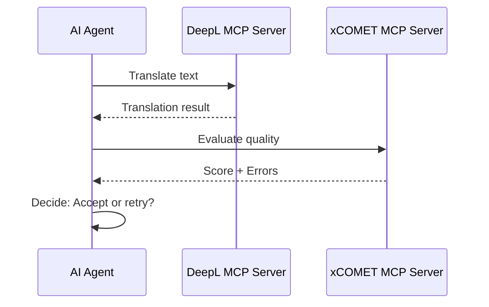

# xCOMET MCP Server

[](https://www.npmjs.com/package/xcomet-mcp-server)
[](https://modelcontextprotocol.io)
[](https://opensource.org/licenses/MIT)

Translation quality evaluation MCP Server powered by [xCOMET](https://github.com/Unbabel/COMET) (eXplainable COMET).

## 🎯 Overview

xCOMET MCP Server provides AI agents with the ability to evaluate machine translation quality. It integrates with the xCOMET model from Unbabel to provide:

- **Quality Scoring**: Scores between 0-1 indicating translation quality
- **Error Detection**: Identifies error spans with severity levels (minor/major/critical)
- **Batch Processing**: Evaluate multiple translation pairs efficiently (optimized single model load)
- **GPU Support**: Optional GPU acceleration for faster inference


## 🔧 Prerequisites

### Python Environment

xCOMET requires Python with the `unbabel-comet` package:

```bash
pip install "unbabel-comet>=2.2.0"
```

### Model Download

The first run will download the xCOMET model (~14GB for XL, ~42GB for XXL):

```bash
# Test model availability
python -c "from comet import download_model; download_model('Unbabel/XCOMET-XL')"
```

### Node.js

- Node.js >= 18.0.0
- npm or yarn

## 📦 Installation

```bash
# Clone the repository
git clone https://github.com/shuji-bonji/xcomet-mcp-server.git
cd xcomet-mcp-server

# Install dependencies
npm install

# Build
npm run build
```

## 🚀 Usage

### With Claude Desktop (npx)

Add to your Claude Desktop configuration (`claude_desktop_config.json`):

```json
{
  "mcpServers": {
    "xcomet": {
      "command": "npx",
      "args": ["-y", "xcomet-mcp-server"]
    }
  }
}
```

### With Claude Code

```bash
claude mcp add xcomet -- npx -y xcomet-mcp-server
```

### Local Installation

If you prefer a local installation:

```bash
npm install -g xcomet-mcp-server
```

Then configure:
```json
{
  "mcpServers": {
    "xcomet": {
      "command": "xcomet-mcp-server"
    }
  }
}
```

### HTTP Mode (Remote Access)

```bash
TRANSPORT=http PORT=3000 npm start
```

Then connect to `http://localhost:3000/mcp`

## 🛠️ Available Tools

### `xcomet_evaluate`

Evaluate translation quality for a single source-translation pair.

**Parameters:**
| Name | Type | Required | Description |
|------|------|----------|-------------|
| `source` | string | ✅ | Original source text |
| `translation` | string | ✅ | Translated text to evaluate |
| `reference` | string | ❌ | Reference translation |
| `source_lang` | string | ❌ | Source language code (ISO 639-1) |
| `target_lang` | string | ❌ | Target language code (ISO 639-1) |
| `response_format` | "json" \| "markdown" | ❌ | Output format (default: "json") |
| `use_gpu` | boolean | ❌ | Use GPU for inference (default: false) |

**Example:**
```json
{
  "source": "The quick brown fox jumps over the lazy dog.",
  "translation": "素早い茶色のキツネが怠惰な犬を飛び越える。",
  "source_lang": "en",
  "target_lang": "ja",
  "use_gpu": true
}
```

**Response:**
```json
{
  "score": 0.847,
  "errors": [],
  "summary": "Good quality (score: 0.847) with 0 error(s) detected."
}
```

### `xcomet_detect_errors`

Focus on detecting and categorizing translation errors.

**Parameters:**
| Name | Type | Required | Description |
|------|------|----------|-------------|
| `source` | string | ✅ | Original source text |
| `translation` | string | ✅ | Translated text to analyze |
| `reference` | string | ❌ | Reference translation |
| `min_severity` | "minor" \| "major" \| "critical" | ❌ | Minimum severity (default: "minor") |
| `response_format` | "json" \| "markdown" | ❌ | Output format |
| `use_gpu` | boolean | ❌ | Use GPU for inference (default: false) |

### `xcomet_batch_evaluate`

Evaluate multiple translation pairs in a single request.

> **Performance Note**: This tool is optimized to load the model only once for all pairs, making it significantly faster than evaluating pairs individually. For 100 pairs, this reduces processing time from ~50 minutes to ~1-2 minutes on CPU.

**Parameters:**
| Name | Type | Required | Description |
|------|------|----------|-------------|
| `pairs` | array | ✅ | Array of {source, translation, reference?} (max 500) |
| `source_lang` | string | ❌ | Source language code |
| `target_lang` | string | ❌ | Target language code |
| `response_format` | "json" \| "markdown" | ❌ | Output format |
| `use_gpu` | boolean | ❌ | Use GPU for inference (default: false) |
| `batch_size` | number | ❌ | Batch size 1-64 (default: 8). Larger = faster but uses more memory |

**Example:**
```json
{
  "pairs": [
    {"source": "Hello", "translation": "こんにちは"},
    {"source": "Goodbye", "translation": "さようなら"}
  ],
  "use_gpu": true,
  "batch_size": 16
}
```

## 🔗 Integration with Other MCP Servers

xCOMET MCP Server is designed to work alongside other MCP servers for complete translation workflows:



### Recommended Workflow

1. **Translate** using DeepL MCP Server (official)
2. **Evaluate** using xCOMET MCP Server
3. **Iterate** if quality is below threshold

### Example: DeepL + xCOMET Integration

Configure both servers in Claude Desktop:

```json
{
  "mcpServers": {
    "deepl": {
      "command": "npx",
      "args": ["-y", "@anthropic/deepl-mcp-server"],
      "env": {
        "DEEPL_API_KEY": "your-api-key"
      }
    },
    "xcomet": {
      "command": "npx",
      "args": ["-y", "xcomet-mcp-server"]
    }
  }
}
```

Then ask Claude:
> "Translate this text to Japanese using DeepL, then evaluate the translation quality with xCOMET. If the score is below 0.8, suggest improvements."

## ⚙️ Configuration

### Environment Variables

| Variable | Default | Description |
|----------|---------|-------------|
| `TRANSPORT` | `stdio` | Transport mode: `stdio` or `http` |
| `PORT` | `3000` | HTTP server port (when TRANSPORT=http) |
| `XCOMET_MODEL` | `Unbabel/XCOMET-XL` | xCOMET model to use |
| `XCOMET_PYTHON_PATH` | (auto-detect) | Python executable path (see below) |

### Model Selection

Choose the model based on your quality/performance needs:

| Model | Parameters | Size | Memory | Reference | Quality | Use Case |
|-------|------------|------|--------|-----------|---------|----------|
| `Unbabel/XCOMET-XL` | 3.5B | ~14GB | ~8-10GB | Optional | ⭐⭐⭐⭐ | Recommended for most use cases |
| `Unbabel/XCOMET-XXL` | 10.7B | ~42GB | ~20GB | Optional | ⭐⭐⭐⭐⭐ | Highest quality, requires more resources |
| `Unbabel/wmt22-comet-da` | 580M | ~2GB | ~3GB | **Required** | ⭐⭐⭐ | Lightweight, faster loading |

> **Important**: `wmt22-comet-da` requires a `reference` translation for evaluation. XCOMET models support referenceless evaluation.

> **Tip**: If you experience memory issues or slow model loading, try `Unbabel/wmt22-comet-da` for faster performance with slightly lower accuracy (but remember to provide reference translations).

**To use a different model**, set the `XCOMET_MODEL` environment variable:

```json
{
  "mcpServers": {
    "xcomet": {
      "command": "npx",
      "args": ["-y", "xcomet-mcp-server"],
      "env": {
        "XCOMET_MODEL": "Unbabel/XCOMET-XXL"
      }
    }
  }
}
```

### Python Path Auto-Detection

The server automatically detects a Python environment with `unbabel-comet` installed:

1. **`XCOMET_PYTHON_PATH`** environment variable (if set)
2. **pyenv** versions (`~/.pyenv/versions/*/bin/python3`) - checks for `comet` module
3. **Homebrew** Python (`/opt/homebrew/bin/python3`, `/usr/local/bin/python3`)
4. **Fallback**: `python3` command

This ensures the server works correctly even when the MCP host (e.g., Claude Desktop) uses a different Python than your terminal.

**Example: Explicit Python path configuration**
```json
{
  "mcpServers": {
    "xcomet": {
      "command": "npx",
      "args": ["-y", "xcomet-mcp-server"],
      "env": {
        "XCOMET_PYTHON_PATH": "/Users/you/.pyenv/versions/3.11.0/bin/python3"
      }
    }
  }
}
```

## ⚡ Performance

### Batch Processing Optimization

The `xcomet_batch_evaluate` tool is optimized to load the xCOMET model only once, regardless of the number of pairs:

| Pairs | Without Optimization | With Optimization | Speedup |
|-------|---------------------|-------------------|---------|
| 10 | ~5 min | ~40 sec | ~7.5x |
| 50 | ~25 min | ~1.5 min | ~17x |
| 100 | ~50 min | ~2 min | ~25x |

### GPU vs CPU Performance

| Mode | 100 Pairs (Estimated) |
|------|----------------------|
| CPU (batch_size=8) | ~2 min |
| GPU (batch_size=16) | ~20-30 sec |

> **Note**: GPU requires CUDA-compatible hardware and PyTorch with CUDA support. If GPU is not available, set `use_gpu: false` (default).

### Best Practices for Large-Scale Evaluation

When evaluating many translation pairs (e.g., multiple files), follow these guidelines for optimal performance:

**1. Batch all pairs in a single call**

```
❌ Bad: Multiple calls (slow - model loads each time)
   for each file:
     xcomet_batch_evaluate(file.pairs)  # ~25s model load per call

✅ Good: Single call with all pairs (fast - model loads once)
   xcomet_batch_evaluate(allPairs)  # ~25s model load total
```

**2. Time breakdown**

| Operation | Time |
|-----------|------|
| Model loading | ~25 seconds (once per call) |
| Inference | ~3-5 seconds per 100 pairs |

**3. Memory considerations**

- XCOMET-XL requires ~8-10GB RAM
- For large batches (500 pairs), ensure sufficient memory
- If memory is limited, split into smaller batches (100-200 pairs)

## 📊 Quality Score Interpretation

| Score Range | Quality | Recommendation |
|-------------|---------|----------------|
| 0.9 - 1.0 | Excellent | Ready for use |
| 0.7 - 0.9 | Good | Minor review recommended |
| 0.5 - 0.7 | Fair | Post-editing needed |
| 0.0 - 0.5 | Poor | Re-translation recommended |

## 🔍 Troubleshooting

### Common Issues

#### "No module named 'comet'"

**Cause**: Python environment without `unbabel-comet` installed.

**Solution**:
```bash
# Check which Python is being used
python3 -c "import sys; print(sys.executable)"

# Install unbabel-comet
pip install "unbabel-comet>=2.2.0"

# Or specify Python path explicitly
export XCOMET_PYTHON_PATH=/path/to/python3
```

#### Model download fails or times out

**Cause**: Large model files (~14GB for XL) require stable internet connection.

**Solution**:
```bash
# Pre-download the model manually
python -c "from comet import download_model; download_model('Unbabel/XCOMET-XL')"
```

#### GPU not detected

**Cause**: PyTorch not installed with CUDA support.

**Solution**:
```bash
# Check CUDA availability
python -c "import torch; print(torch.cuda.is_available())"

# If False, reinstall PyTorch with CUDA
pip install torch --index-url https://download.pytorch.org/whl/cu118
```

#### Slow performance on Mac (MPS)

**Cause**: Mac MPS (Metal Performance Shaders) has compatibility issues with some operations.

**Solution**: The server automatically uses `num_workers=1` for Mac MPS compatibility. For best performance on Mac, use CPU mode (`use_gpu: false`).

#### High memory usage or crashes

**Cause**: XCOMET-XL requires ~8-10GB RAM. Multiple consecutive evaluations can cause memory spikes.

**Solutions**:
1. **Batch your evaluations**: Use a single `xcomet_batch_evaluate` call instead of multiple `xcomet_evaluate` calls
2. **Reduce batch size**: If memory is limited, process in smaller batches (100-200 pairs)
3. **Use a lighter model**: Consider `Unbabel/wmt22-comet-da` for lower memory usage (see Model Selection)
4. **Close other applications**: Free up RAM before running large evaluations

```bash
# Check available memory
free -h  # Linux
vm_stat | head -5  # macOS
```

#### VS Code or IDE crashes during evaluation

**Cause**: Memory spikes when loading the model repeatedly.

**Solution**:
- Batch all translation pairs into a single `xcomet_batch_evaluate` call
- Model loads once per call (~25s), then inference is fast (~3-5s per 100 pairs)
- Avoid calling `xcomet_evaluate` in a loop

### Getting Help

If you encounter issues:

1. Check the [GitHub Issues](https://github.com/shuji-bonji/xcomet-mcp-server/issues)
2. Enable debug logging by checking Claude Desktop's Developer Mode logs
3. Open a new issue with:
   - Your OS and Python version
   - The error message
   - Your configuration (without sensitive data)

## 🧪 Development

```bash
# Install dependencies
npm install

# Build TypeScript
npm run build

# Watch mode
npm run dev

# Test with MCP Inspector
npm run inspect
```

## 📋 Changelog

See [CHANGELOG.md](CHANGELOG.md) for version history and updates.

## 📝 License

MIT License - see [LICENSE](LICENSE) for details.

## 🙏 Acknowledgments

- [Unbabel](https://unbabel.com/) for the xCOMET model
- [Anthropic](https://anthropic.com/) for the MCP protocol
- [Model Context Protocol](https://modelcontextprotocol.io/) community

## 📚 References

- [xCOMET Paper](https://direct.mit.edu/tacl/article/doi/10.1162/tacl_a_00683/124263/xcomet-Transparent-Machine-Translation-Evaluation)
- [COMET Framework](https://github.com/Unbabel/COMET)
- [MCP Specification](https://spec.modelcontextprotocol.io/)
