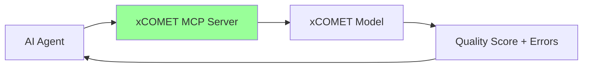
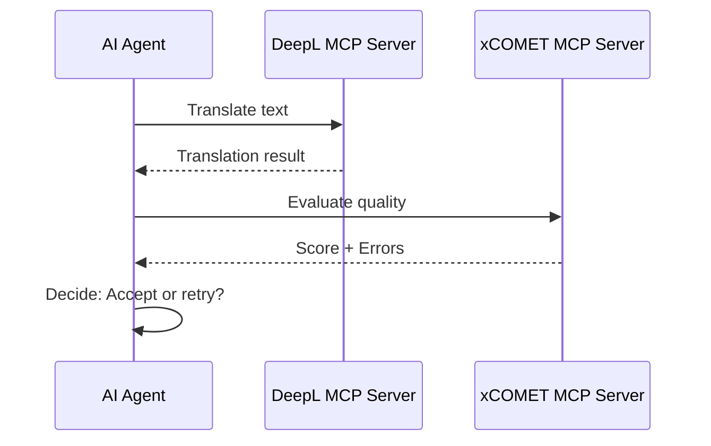

# xCOMET MCP Server

[](https://modelcontextprotocol.io)
[](https://opensource.org/licenses/MIT)

Translation quality evaluation MCP Server powered by [xCOMET](https://github.com/Unbabel/COMET) (eXplainable COMET).

## 🎯 Overview

xCOMET MCP Server provides AI agents with the ability to evaluate machine translation quality. It integrates with the xCOMET model from Unbabel to provide:

- **Quality Scoring**: Scores between 0-1 indicating translation quality
- **Error Detection**: Identifies error spans with severity levels (minor/major/critical)
- **Batch Processing**: Evaluate multiple translation pairs efficiently



## 🔧 Prerequisites

### Python Environment

xCOMET requires Python with the `unbabel-comet` package:

```bash
pip install "unbabel-comet>=2.2.0"
```

### Model Download

The first run will download the xCOMET model (~14GB for XL, ~42GB for XXL):

```bash
# Test model availability
python -c "from comet import download_model; download_model('Unbabel/XCOMET-XL')"
```

### Node.js

- Node.js >= 18.0.0
- npm or yarn

## 📦 Installation

```bash
# Clone the repository
git clone https://github.com/shuji-bonji/xcomet-mcp-server.git
cd xcomet-mcp-server

# Install dependencies
npm install

# Build
npm run build
```

## 🚀 Usage

### With Claude Desktop

Add to your Claude Desktop configuration (`claude_desktop_config.json`):

```json
{
  "mcpServers": {
    "xcomet": {
      "command": "node",
      "args": ["/path/to/xcomet-mcp-server/dist/index.js"]
    }
  }
}
```

### With Claude Code

```bash
claude mcp add xcomet node /path/to/xcomet-mcp-server/dist/index.js
```

### HTTP Mode (Remote Access)

```bash
TRANSPORT=http PORT=3000 npm start
```

Then connect to `http://localhost:3000/mcp`

## 🛠️ Available Tools

### `xcomet_evaluate`

Evaluate translation quality for a single source-translation pair.

**Parameters:**
| Name | Type | Required | Description |
|------|------|----------|-------------|
| `source` | string | ✅ | Original source text |
| `translation` | string | ✅ | Translated text to evaluate |
| `reference` | string | ❌ | Reference translation |
| `source_lang` | string | ❌ | Source language code (ISO 639-1) |
| `target_lang` | string | ❌ | Target language code (ISO 639-1) |
| `response_format` | "json" \| "markdown" | ❌ | Output format (default: "json") |

**Example:**
```json
{
  "source": "The quick brown fox jumps over the lazy dog.",
  "translation": "素早い茶色のキツネが怠惰な犬を飛び越える。",
  "source_lang": "en",
  "target_lang": "ja"
}
```

**Response:**
```json
{
  "score": 0.847,
  "errors": [],
  "summary": "Good quality (score: 0.847) with 0 error(s) detected."
}
```

### `xcomet_detect_errors`

Focus on detecting and categorizing translation errors.

**Parameters:**
| Name | Type | Required | Description |
|------|------|----------|-------------|
| `source` | string | ✅ | Original source text |
| `translation` | string | ✅ | Translated text to analyze |
| `reference` | string | ❌ | Reference translation |
| `min_severity` | "minor" \| "major" \| "critical" | ❌ | Minimum severity (default: "minor") |
| `response_format` | "json" \| "markdown" | ❌ | Output format |

### `xcomet_batch_evaluate`

Evaluate multiple translation pairs in a single request.

**Parameters:**
| Name | Type | Required | Description |
|------|------|----------|-------------|
| `pairs` | array | ✅ | Array of {source, translation, reference?} |
| `source_lang` | string | ❌ | Source language code |
| `target_lang` | string | ❌ | Target language code |
| `response_format` | "json" \| "markdown" | ❌ | Output format |

## 🔗 Integration with Other MCP Servers

xCOMET MCP Server is designed to work alongside other MCP servers for complete translation workflows:



### Recommended Workflow

1. **Translate** using DeepL MCP Server (official)
2. **Evaluate** using xCOMET MCP Server
3. **Iterate** if quality is below threshold

## ⚙️ Configuration

### Environment Variables

| Variable | Default | Description |
|----------|---------|-------------|
| `TRANSPORT` | `stdio` | Transport mode: `stdio` or `http` |
| `PORT` | `3000` | HTTP server port (when TRANSPORT=http) |
| `XCOMET_MODEL` | `Unbabel/XCOMET-XL` | xCOMET model to use |
| `PYTHON_PATH` | `python3` | Python executable path |

### Model Options

| Model | Parameters | Size | Quality |
|-------|------------|------|---------|
| `Unbabel/XCOMET-XL` | 3.5B | ~14GB | Recommended |
| `Unbabel/XCOMET-XXL` | 10.7B | ~42GB | Highest |

## 📊 Quality Score Interpretation

| Score Range | Quality | Recommendation |
|-------------|---------|----------------|
| 0.9 - 1.0 | Excellent | Ready for use |
| 0.7 - 0.9 | Good | Minor review recommended |
| 0.5 - 0.7 | Fair | Post-editing needed |
| 0.0 - 0.5 | Poor | Re-translation recommended |

## 🧪 Development

```bash
# Install dependencies
npm install

# Build TypeScript
npm run build

# Watch mode
npm run dev

# Test with MCP Inspector
npm run inspect
```

## 📝 License

MIT License - see [LICENSE](LICENSE) for details.

## 🙏 Acknowledgments

- [Unbabel](https://unbabel.com/) for the xCOMET model
- [Anthropic](https://anthropic.com/) for the MCP protocol
- [Model Context Protocol](https://modelcontextprotocol.io/) community

## 📚 References

- [xCOMET Paper](https://direct.mit.edu/tacl/article/doi/10.1162/tacl_a_00683/124263/xcomet-Transparent-Machine-Translation-Evaluation)
- [COMET Framework](https://github.com/Unbabel/COMET)
- [MCP Specification](https://spec.modelcontextprotocol.io/)
