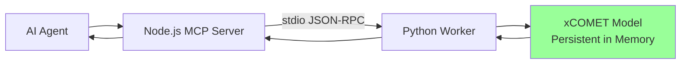
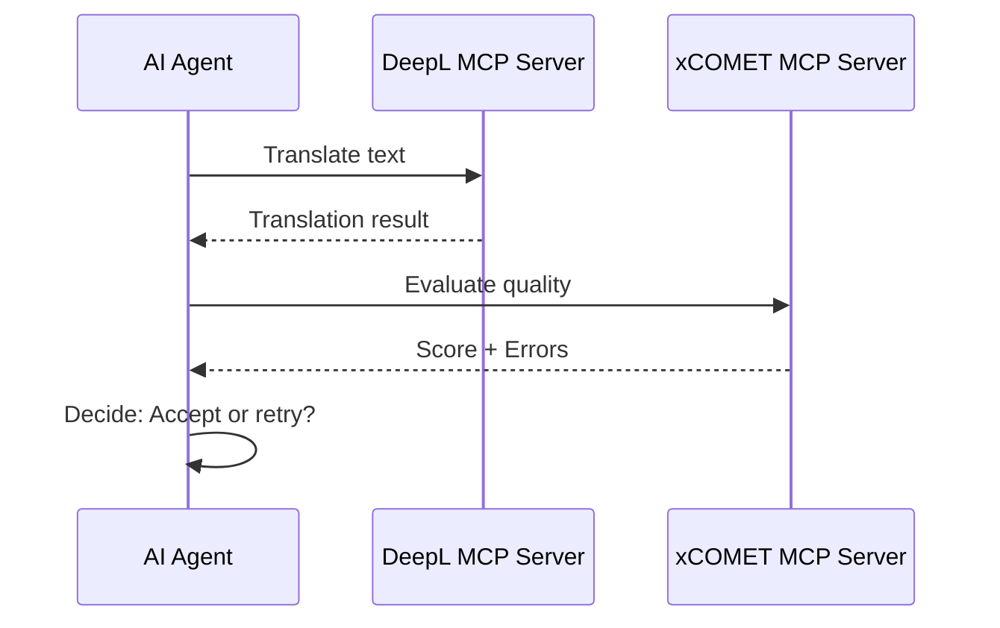
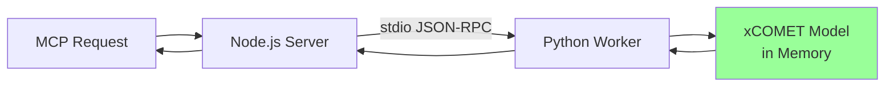

# xCOMET MCP Server

[](https://www.npmjs.com/package/xcomet-mcp-server)
[](https://github.com/shuji-bonji/xcomet-mcp-server/actions/workflows/ci.yml)
[](https://modelcontextprotocol.io)
[](https://opensource.org/licenses/MIT)

**[日本語版 README はこちら](README.ja.md)**

> ⚠️ This is an unofficial community project, not affiliated with Unbabel.

Translation quality evaluation MCP Server powered by [xCOMET](https://github.com/Unbabel/COMET) (eXplainable COMET).

## 🎯 Overview

xCOMET MCP Server provides AI agents with the ability to evaluate machine translation quality. It integrates with the xCOMET model from Unbabel to provide:

- **Quality Scoring**: Scores between 0-1 indicating translation quality
- **Error Detection**: Identifies error spans with severity levels (minor/major/critical)
- **Batch Processing**: Evaluate multiple translation pairs efficiently (optimized single model load)
- **GPU Support**: Optional GPU acceleration for faster inference


```mermaid
graph LR
    A[AI Agent] --> B[Node.js MCP Server]
    B -- stdio JSON-RPC --> C[Python Worker]
    C --> D[xCOMET Model<br/>Persistent in Memory]
    D --> C
    C --> B
    B --> A

    style D fill:#9f9
```

## 🔧 Prerequisites

### Python Environment

- Python 3.9 - 3.12 recommended (3.13+ is not yet supported by xCOMET dependencies)

xCOMET requires Python with several packages. We recommend using a virtual environment:

```bash
# If using uv (recommended - auto-downloads the correct Python version)
uv venv ~/.xcomet-venv --python 3.12
source ~/.xcomet-venv/bin/activate
uv pip install "unbabel-comet>=2.2.7,<3.0"

# Or using standard venv (requires Python 3.9-3.12 already installed)
python3 -m venv ~/.xcomet-venv
source ~/.xcomet-venv/bin/activate  # Windows: ~/.xcomet-venv\Scripts\activate
pip install "unbabel-comet>=2.2.7,<3.0"
```

> **Why Python 3.9-3.12?** `unbabel-comet` declares `numpy = "^1.20.0"`, so it
> resolves numpy 1.x. The last numpy 1.x release, 1.26.4, ships wheels for
> cp39-cp312 only. On Python 3.13 or later, pip has to build numpy from source.

> **Note (v0.5.0+)**: The Python worker now talks to Node.js over stdin/stdout
> (line-delimited JSON-RPC). FastAPI, uvicorn, and pydantic are no longer
> required — only `unbabel-comet` is.

> **Note**: When using with Claude Desktop or other MCP hosts, set `XCOMET_PYTHON_PATH` to point to the venv Python (see [Configuration](#-configuration)).

### Model Download

> **Important**: XCOMET-XL and XCOMET-XXL are **gated models** on HuggingFace. You must:
> 1. Create a [HuggingFace](https://huggingface.co/) account
> 2. Visit [Unbabel/XCOMET-XL](https://huggingface.co/Unbabel/XCOMET-XL) and request access
> 3. Authenticate, either via the CLI:
>    ```bash
>    source ~/.xcomet-venv/bin/activate
>    hf auth login
>    ```
>    (`huggingface-cli login` still works but prints a deprecation warning since
>    huggingface_hub 0.34; `hf` is the current command.)
>
>    Or by setting `HF_TOKEN` in the MCP host's `env` block, which is the option
>    when the host launches the server in an environment where no CLI login has
>    been performed:
>    ```json
>    "env": {
>      "XCOMET_PYTHON_PATH": "~/.xcomet-venv/bin/python3",
>      "HF_TOKEN": "hf_..."
>    }
>    ```
>    huggingface_hub reads `HF_TOKEN` first and falls back to the token file
>    written by `hf auth login`.
>
> `Unbabel/wmt22-comet-da` does **not** require authentication (but requires reference translations).

After authentication, download the model (~14GB for XL, ~42GB for XXL):

```bash
source ~/.xcomet-venv/bin/activate
python -c "from comet import download_model; download_model('Unbabel/XCOMET-XL')"
```

#### Where the model is stored

**Not in the virtualenv.** The venv holds the Python packages; the model weights
go to the huggingface_hub cache, which is a separate directory shared by every
tool on the machine that pulls from the Hub.

```
~/.xcomet-venv/                              ← Python packages only
└── lib/python3.x/site-packages/
    ├── comet/                               unbabel-comet itself
    └── torch/  transformers/  ...           its dependencies

~/.cache/huggingface/                        ← the model weights live here
└── hub/
    └── models--Unbabel--XCOMET-XL/
        ├── blobs/                           the actual ~14GB checkpoint
        └── snapshots/<revision>/
            ├── checkpoints/model.ckpt       what download_model() returns
            └── hparams.yaml
```

`download_model()` passes `cache_dir=None` to `snapshot_download()`, so
huggingface_hub picks the location: `HF_HUB_CACHE`, which defaults to
`HF_HOME/hub`, where `HF_HOME` defaults to `$XDG_CACHE_HOME/huggingface`
(`~/.cache/huggingface` when `XDG_CACHE_HOME` is unset).

Three consequences worth knowing:

- Rebuilding or deleting the venv does **not** re-download the model.
- Several venvs, and other Hub-based tools, share the same copy.
- The size of the venv directory does not account for the 14GB. Use
  `hf cache scan` to see what is actually on disk, and `hf cache delete` to
  remove a revision.

To put the checkpoint somewhere else — a larger volume, a shared drive — set
`XCOMET_SAVING_DIRECTORY` (v0.7.0+) or the standard `HF_HOME`. Both are read at
download time, so a model already downloaded to the default location is not
moved; it is downloaded again into the new one.

### Node.js

- Node.js >= 22.0.0 (matches `engines.node` in `package.json`; CI runs on 22 and 24)
- npm or yarn

## 📦 Installation

> **Note**: If you just want to **use** xCOMET MCP Server, you do **not** need to clone this repository. Install the Python environment and model (see [Prerequisites](#-prerequisites)), then use `npx` (see [Usage](#-usage)). The section below is for contributors and local development only.

### Local Development

For contributors and local development:

```bash
# Clone the repository
git clone https://github.com/shuji-bonji/xcomet-mcp-server.git
cd xcomet-mcp-server

# Set up Python virtual environment and install dependencies
uv venv .venv --python 3.12    # or: python3 -m venv .venv
source .venv/bin/activate
pip install -r python/requirements.txt

# Install Node.js dependencies and build
npm install
npm run build
```

## 🚀 Usage

### With Claude Desktop (npx)

Add to your Claude Desktop configuration (`claude_desktop_config.json`):

```json
{
  "mcpServers": {
    "xcomet": {
      "command": "npx",
      "args": ["-y", "xcomet-mcp-server"],
      "env": {
        "XCOMET_PYTHON_PATH": "~/.xcomet-venv/bin/python3"
      }
    }
  }
}
```

> **Tip**: If you installed Python packages system-wide or use pyenv, `XCOMET_PYTHON_PATH` may be omitted (auto-detection will find it). See [Python Path Auto-Detection](#python-path-auto-detection) for details.

### With Claude Code

```bash
claude mcp add xcomet --env XCOMET_PYTHON_PATH=~/.xcomet-venv/bin/python3 -- npx -y xcomet-mcp-server
```

### Global Installation

If you prefer installing globally:

```bash
npm install -g xcomet-mcp-server
```

Then configure:
```json
{
  "mcpServers": {
    "xcomet": {
      "command": "xcomet-mcp-server",
      "env": {
        "XCOMET_PYTHON_PATH": "~/.xcomet-venv/bin/python3"
      }
    }
  }
}
```

### Local Development Build

If you cloned and built the repository locally (see [Installation](#-installation-local-development)):

```json
{
  "mcpServers": {
    "xcomet": {
      "command": "node",
      "args": ["/path/to/xcomet-mcp-server/dist/index.js"],
      "env": {
        "XCOMET_PYTHON_PATH": "~/.xcomet-venv/bin/python3"
      }
    }
  }
}
```

## 🛠️ Available Tools

### `xcomet_evaluate`

Evaluate translation quality for a single source-translation pair.

**Parameters:**
| Name | Type | Required | Description |
|------|------|----------|-------------|
| `source` | string | ✅ | Original source text |
| `translation` | string | ✅ | Translated text to evaluate |
| `reference` | string | ❌ | Reference translation |
| `source_lang` | string | ❌ | Source language code (ISO 639-1) |
| `target_lang` | string | ❌ | Target language code (ISO 639-1) |
| `response_format` | "json" \| "markdown" | ❌ | Output format (default: "json") |
| `use_gpu` | boolean | ❌ | Use GPU for inference (default: false) |

**Example:**
```json
{
  "source": "The quick brown fox jumps over the lazy dog.",
  "translation": "素早い茶色のキツネが怠惰な犬を飛び越える。",
  "source_lang": "en",
  "target_lang": "ja",
  "use_gpu": true
}
```

**Response:**
```json
{
  "score": 0.847,
  "errors": [],
  "summary": "Good quality (score: 0.847) with 0 error(s) detected."
}
```

### `xcomet_detect_errors`

Focus on detecting and categorizing translation errors.

**Parameters:**
| Name | Type | Required | Description |
|------|------|----------|-------------|
| `source` | string | ✅ | Original source text |
| `translation` | string | ✅ | Translated text to analyze |
| `reference` | string | ❌ | Reference translation |
| `min_severity` | "minor" \| "major" \| "critical" | ❌ | Minimum severity (default: "minor") |
| `response_format` | "json" \| "markdown" | ❌ | Output format |
| `use_gpu` | boolean | ❌ | Use GPU for inference (default: false) |

### `xcomet_batch_evaluate`

Evaluate multiple translation pairs in a single request.

> **Performance Note**: With the persistent server architecture (v0.3.0+), the model stays loaded in memory. Batch evaluation processes all pairs efficiently without reloading the model.

**Parameters:**
| Name | Type | Required | Description |
|------|------|----------|-------------|
| `pairs` | array | ✅ | Array of {source, translation, reference?} (max 500) |
| `source_lang` | string | ❌ | Source language code |
| `target_lang` | string | ❌ | Target language code |
| `response_format` | "json" \| "markdown" | ❌ | Output format |
| `use_gpu` | boolean | ❌ | Use GPU for inference (default: false) |
| `batch_size` | number | ❌ | Batch size 1-64 (default: 8). Larger = faster but uses more memory |

**Example:**
```json
{
  "pairs": [
    {"source": "Hello", "translation": "こんにちは"},
    {"source": "Goodbye", "translation": "さようなら"}
  ],
  "use_gpu": true,
  "batch_size": 16
}
```

## 🔗 Integration with Other MCP Servers

xCOMET MCP Server is designed to work alongside other MCP servers for complete translation workflows:


```mermaid
sequenceDiagram
    participant Agent as AI Agent
    participant DeepL as DeepL MCP Server
    participant xCOMET as xCOMET MCP Server
    
    Agent->>DeepL: Translate text
    DeepL-->>Agent: Translation result
    Agent->>xCOMET: Evaluate quality
    xCOMET-->>Agent: Score + Errors
    Agent->>Agent: Decide: Accept or retry?
```

### Recommended Workflow

1. **Translate** using DeepL MCP Server (official)
2. **Evaluate** using xCOMET MCP Server
3. **Iterate** if quality is below threshold

### Example: DeepL + xCOMET Integration

Configure both servers in Claude Desktop:

```json
{
  "mcpServers": {
    "deepl": {
      "command": "npx",
      "args": ["-y", "@anthropic/deepl-mcp-server"],
      "env": {
        "DEEPL_API_KEY": "your-api-key"
      }
    },
    "xcomet": {
      "command": "npx",
      "args": ["-y", "xcomet-mcp-server"],
      "env": {
        "XCOMET_PYTHON_PATH": "~/.xcomet-venv/bin/python3"
      }
    }
  }
}
```

Then ask Claude:
> "Translate this text to Japanese using DeepL, then evaluate the translation quality with xCOMET. If the score is below 0.8, suggest improvements."

## ⚙️ Configuration

### Environment Variables

| Variable | Default | Description |
|----------|---------|-------------|
| `XCOMET_MODEL` | `Unbabel/XCOMET-XL` | xCOMET model to use |
| `XCOMET_PYTHON_PATH` | (auto-detect) | Python executable path (see below) |
| `XCOMET_PRELOAD` | `false` | Pre-load model at startup (v0.3.1+) |
| `XCOMET_DEBUG` | `false` | Enable verbose debug logging (v0.3.1+) |
| `XCOMET_NUM_WORKERS` | `1` | DataLoader workers for `model.predict()` (v0.6.0+). Increase to better utilize idle CPU cores when running large batches, especially on GPU. Invalid values silently fall back to `1`. |
| `XCOMET_SAVING_DIRECTORY` | (HuggingFace cache) | Directory to download the checkpoint into (v0.7.0+). Unset, the model goes to the huggingface_hub cache (`HF_HOME`, default `~/.cache/huggingface`). Set this to put a 14GB (XL) or 43GB (XXL) checkpoint on another volume. |
| `XCOMET_LOCAL_FILES_ONLY` | `false` | Resolve the checkpoint from the local cache only (v0.7.0+). Set to `true` to start with no network access; the model must already be downloaded. |
| `HF_TOKEN` | (unset) | HuggingFace access token, read by huggingface_hub. An alternative to `hf auth login` for the gated models (XCOMET-XL, XCOMET-XXL, the CometKiwi models). |

### Model Selection

Choose the model based on your quality/performance needs:

| Model | Parameters | Size | Memory | Reference | HF Auth | Quality | Use Case |
|-------|------------|------|--------|-----------|---------|---------|----------|
| `Unbabel/XCOMET-XL` | 3.5B | ~14GB | ~8-10GB | Optional | ✅ Required | ⭐⭐⭐⭐ | Recommended for most use cases |
| `Unbabel/XCOMET-XXL` | 10.7B | ~42GB | ~20GB | Optional | ✅ Required | ⭐⭐⭐⭐⭐ | Highest quality, requires more resources |
| `Unbabel/wmt22-comet-da` | 580M | ~2GB | ~3GB | **Required** | Not required | ⭐⭐⭐ | Lightweight, faster loading |

> **Important**: XCOMET-XL and XCOMET-XXL are gated models on HuggingFace. Each model requires **separate** access approval. See [Model Download](#model-download) for authentication setup.

> **Important**: `wmt22-comet-da` requires a `reference` translation for evaluation. XCOMET models support referenceless evaluation.

> **Tip**: If you experience memory issues or slow model loading, try `Unbabel/wmt22-comet-da` for faster performance with slightly lower accuracy (but remember to provide reference translations).

**To use a different model**, set the `XCOMET_MODEL` environment variable:

```json
{
  "mcpServers": {
    "xcomet": {
      "command": "npx",
      "args": ["-y", "xcomet-mcp-server"],
      "env": {
        "XCOMET_MODEL": "Unbabel/XCOMET-XXL"
      }
    }
  }
}
```

### Python Path Auto-Detection

The server automatically detects a Python environment with `unbabel-comet` installed:

1. **`XCOMET_PYTHON_PATH`** environment variable (if set)
2. **pyenv** versions (`~/.pyenv/versions/*/bin/python3`) - checks for `comet` module
3. **Homebrew** Python (`/opt/homebrew/bin/python3`, `/usr/local/bin/python3`)
4. **Fallback**: `python3` command

This ensures the server works correctly even when the MCP host (e.g., Claude Desktop) uses a different Python than your terminal.

**Example: Explicit Python path configuration**
```json
{
  "mcpServers": {
    "xcomet": {
      "command": "npx",
      "args": ["-y", "xcomet-mcp-server"],
      "env": {
        "XCOMET_PYTHON_PATH": "/Users/you/.pyenv/versions/3.11.0/bin/python3"
      }
    }
  }
}
```

## ⚡ Performance

### Persistent Worker Architecture (v0.3.0+, stdio since v0.5.0)

The server uses a **persistent Python worker process** that keeps the xCOMET
model loaded in memory. The Node.js MCP server talks to the worker over
stdin/stdout using a line-delimited JSON-RPC protocol — no local HTTP
listener, no port binding, no FastAPI.

| Request | Time | Notes |
|---------|------|-------|
| First request | ~25-90s | Model loading (varies by model size) |
| Subsequent requests | **~500ms** | Model already loaded |

This provides a **177x speedup** for consecutive evaluations compared to reloading the model each time.

### Eager Loading (v0.3.1+)

Enable `XCOMET_PRELOAD=true` to pre-load the model at server startup:

```json
{
  "mcpServers": {
    "xcomet": {
      "command": "npx",
      "args": ["-y", "xcomet-mcp-server"],
      "env": {
        "XCOMET_PRELOAD": "true"
      }
    }
  }
}
```

With preload enabled, **all requests are fast** (~500ms), including the first one.


```mermaid
graph LR
    A[MCP Request] --> B[Node.js Server]
    B -- stdio JSON-RPC --> C[Python Worker]
    C --> D[xCOMET Model<br/>in Memory]
    D --> C
    C --> B
    B --> A

    style D fill:#9f9
```

### Batch Processing Optimization

The `xcomet_batch_evaluate` tool processes all pairs with a single model load:

| Pairs | Estimated Time |
|-------|----------------|
| 10 | ~30-40 sec |
| 50 | ~1-1.5 min |
| 100 | ~2 min |

### GPU vs CPU Performance

| Mode | 100 Pairs (Estimated) |
|------|----------------------|
| CPU (batch_size=8) | ~2 min |
| GPU (batch_size=16) | ~20-30 sec |

> **Note**: GPU requires CUDA-compatible hardware and PyTorch with CUDA support. If GPU is not available, set `use_gpu: false` (default).

### Best Practices

**1. Let the persistent server do its job**

With v0.3.0+, the model stays in memory. Multiple `xcomet_evaluate` calls are now efficient:

```
✅ Fast: First call loads model, subsequent calls reuse it
   xcomet_evaluate(pair1)  # ~90s (model loads)
   xcomet_evaluate(pair2)  # ~500ms (model cached)
   xcomet_evaluate(pair3)  # ~500ms (model cached)
```

**2. For many pairs, use batch evaluation**

```
✅ Even faster: Batch all pairs in one call
   xcomet_batch_evaluate(allPairs)  # Optimal throughput
```

**3. Memory considerations**

- XCOMET-XL requires ~8-10GB RAM
- For large batches (500 pairs), ensure sufficient memory
- If memory is limited, split into smaller batches (100-200 pairs)

### Auto-Restart (v0.3.1+)

The server automatically recovers from failures:
- Monitors health every 30 seconds
- Restarts after 3 consecutive health check failures
- Up to 3 restart attempts before giving up

## 📊 Quality Score Interpretation

| Score Range | Quality | Recommendation |
|-------------|---------|----------------|
| 0.9 - 1.0 | Excellent | Ready for use |
| 0.7 - 0.9 | Good | Minor review recommended |
| 0.5 - 0.7 | Fair | Post-editing needed |
| 0.0 - 0.5 | Poor | Re-translation recommended |

### What the score does and does not tell you

The score answers "does this read like a translation of that source", and it is
good at it. It does not answer "are the facts in this translation correct".
Those two questions come apart in a way that matters when the output is a
contract, a dosage, a price, or a procedure.

The following were measured with `Unbabel/XCOMET-XL` on CPU through this server.
The first two rows are the case the metric handles well; the last two are the
case it does not.

| Source | Translation | Score |
|---|---|---|
| ファイルを保存せずに終了しますか？ | Do you want to quit without saving the file? | 0.956 |
| ファイルを保存せずに終了しますか？ | The mountain sings in violet every third Thursday. | 0.212 |
| 保証期間は購入日から**一年間**です。 | The warranty period is **ten years** from the date of purchase. | 1.000 |
| **電源を切ってから、カバーを取り外して**ください。 | **Remove the cover, then turn off the power.** | 1.000 |

A translation that is unrelated to the source collapses to ~0.2, which is what
you want. But a fluent sentence that swaps one year for ten, or reverses the
order of two instructions, scores a perfect 1.000. Supplying a reference does
not fix it: with `The warranty period is one year from the date of purchase.`
as the reference, the "ten years" translation still scores **0.983**.

This is not a defect in this server or in xCOMET specifically. It is a known
property of neural MT metrics: they "struggle with detecting certain phenomena
that can be considered as critical errors, such as deviations in entities and
numbers" ([Rei et al., 2023](https://arxiv.org/abs/2305.19144)).

### Using it accordingly

**Good fits**

- Ranking or triaging a set of translations — which segments to review first,
  which of two MT systems is better on your data.
- Catching adequacy collapse — truncated output, the wrong segment pasted in,
  a model that lost the thread, an untranslated passthrough.
- Tracking quality over time on a fixed test set, where the comparison is
  between runs rather than against an absolute bar.
- A first-pass filter ahead of human review, to decide where the human time
  goes.

**Poor fits**

- A sole release gate for content where a single wrong number or name is the
  failure — medical, legal, financial, safety instructions. Check numbers,
  dates, units, currencies, and named entities separately, with a rule that
  actually compares them; the score will not do it for you.
- An absolute quality claim. 0.95 is not "95% correct", and the value is not
  comparable across models, language pairs, or segment lengths.
- Very short segments (a UI label, a single word), where the score saturates
  and stops discriminating.

**Use `xcomet_detect_errors` alongside the score.** The error spans mark
*where* the model believes something went wrong, with an MQM severity. A high
score with a `critical` span is a more useful signal than either number alone.

## 🔍 Troubleshooting

### Common Issues

#### "No module named 'comet'"

**Cause**: Python environment without `unbabel-comet` installed.

**Solution**:
```bash
# Check which Python is being used
python3 -c "import sys; print(sys.executable)"

# If using a virtual environment, make sure it's activated
source .venv/bin/activate
pip install -r python/requirements.txt

# For MCP hosts (e.g., Claude Desktop), specify the venv Python path
export XCOMET_PYTHON_PATH=~/.xcomet-venv/bin/python3
```

#### Model download fails or times out

**Cause**: Large model files (~14GB for XL) require stable internet connection. XCOMET models also require HuggingFace authentication (see [Model Download](#model-download)).

**Solution**:
```bash
# Authenticate with HuggingFace (required for XCOMET-XL/XXL)
hf auth login          # or: export HF_TOKEN=hf_...

# Pre-download the model manually
python -c "from comet import download_model; download_model('Unbabel/XCOMET-XL')"
```

If the download was interrupted, the cache keeps a snapshot directory with no
`checkpoints/model.ckpt` in it. The server reports that path and asks you to
delete the directory; `hf cache scan` lists where it is.

#### GPU not detected

**Cause**: PyTorch not installed with CUDA support.

**Solution**:
```bash
# Check CUDA availability
python -c "import torch; print(torch.cuda.is_available())"

# If False, reinstall PyTorch with CUDA
pip install torch --index-url https://download.pytorch.org/whl/cu118
```

#### Slow performance on Mac (MPS)

**Cause**: Mac MPS (Metal Performance Shaders) has compatibility issues with some operations.

**Solution**: The server automatically uses `num_workers=1` for Mac MPS compatibility. For best performance on Mac, use CPU mode (`use_gpu: false`).

#### High memory usage or crashes

**Cause**: XCOMET-XL requires ~8-10GB RAM.

**Solutions**:
1. **Use the persistent server** (v0.3.0+): Model loads once and stays in memory, avoiding repeated memory spikes
2. **Use a lighter model**: Set `XCOMET_MODEL=Unbabel/wmt22-comet-da` for lower memory usage (~3GB)
3. **Reduce batch size**: For large batches, process in smaller chunks (100-200 pairs)
4. **Close other applications**: Free up RAM before running large evaluations

```bash
# Check available memory
free -h  # Linux
vm_stat | head -5  # macOS
```

#### VS Code or IDE crashes during evaluation

**Cause**: High memory usage from the xCOMET model (~8-10GB for XL).

**Solution**:
- With v0.3.0+, the model loads once and stays in memory (no repeated loading)
- If memory is still an issue, use a lighter model: `XCOMET_MODEL=Unbabel/wmt22-comet-da`
- Close other memory-intensive applications before evaluation

### Getting Help

If you encounter issues:

1. Check the [GitHub Issues](https://github.com/shuji-bonji/xcomet-mcp-server/issues)
2. Enable debug logging (check Claude Desktop's Developer Mode logs, or set `XCOMET_DEBUG=true`)
3. Open a new issue with:
   - Your OS and Python version
   - The error message
   - Your configuration (without sensitive data)

## 🧪 Development

```bash
# Install dependencies
npm install

# Build TypeScript
npm run build

# Watch mode
npm run dev

# Run tests
npm test

# Test with MCP Inspector
npm run inspect
```

## 📋 Changelog

See [CHANGELOG.md](CHANGELOG.md) for version history and updates.

## 📝 License

MIT License - see [LICENSE](LICENSE) for details.

## 🙏 Acknowledgments

- [Unbabel](https://unbabel.com/) for the xCOMET model
- [Anthropic](https://anthropic.com/) for the MCP protocol
- [Model Context Protocol](https://modelcontextprotocol.io/) community

## 📚 References

- [xCOMET Paper](https://direct.mit.edu/tacl/article/doi/10.1162/tacl_a_00683/124263/xcomet-Transparent-Machine-Translation-Evaluation)
- [COMET Framework](https://github.com/Unbabel/COMET)
- [BLEU Meets COMET (Rei et al., 2023)](https://arxiv.org/abs/2305.19144) — on neural metrics missing entity and number errors; the basis for [What the score does and does not tell you](#what-the-score-does-and-does-not-tell-you)
- [Hugging Face Hub cache layout](https://huggingface.co/docs/huggingface_hub/guides/manage-cache)
- [MCP Specification](https://spec.modelcontextprotocol.io/)
