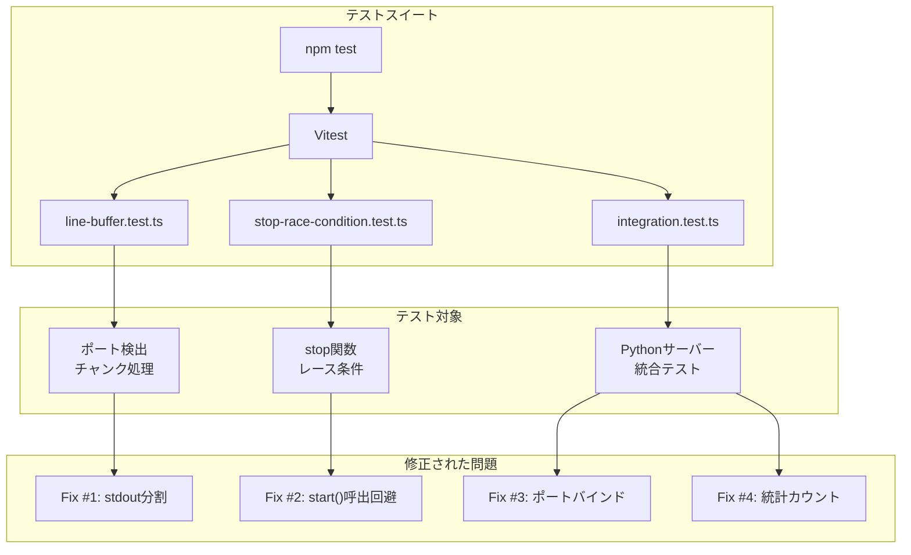
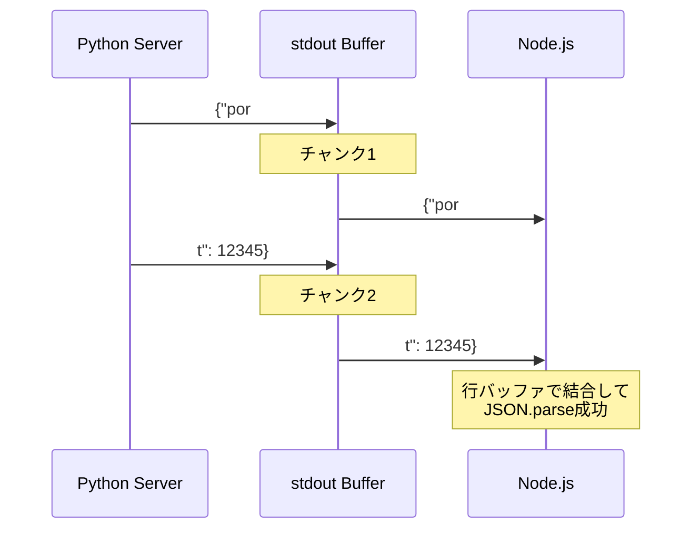
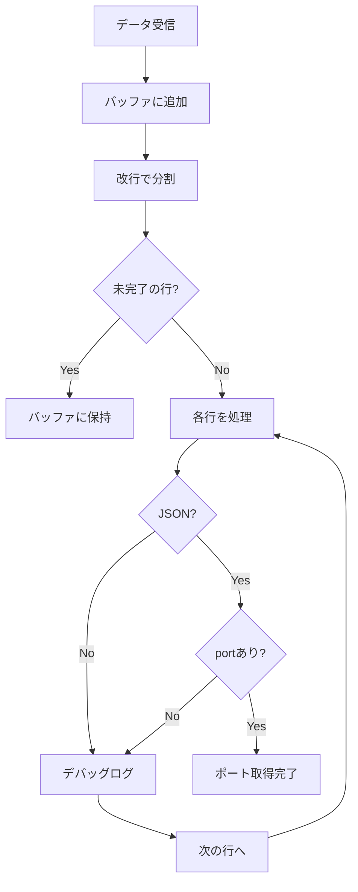
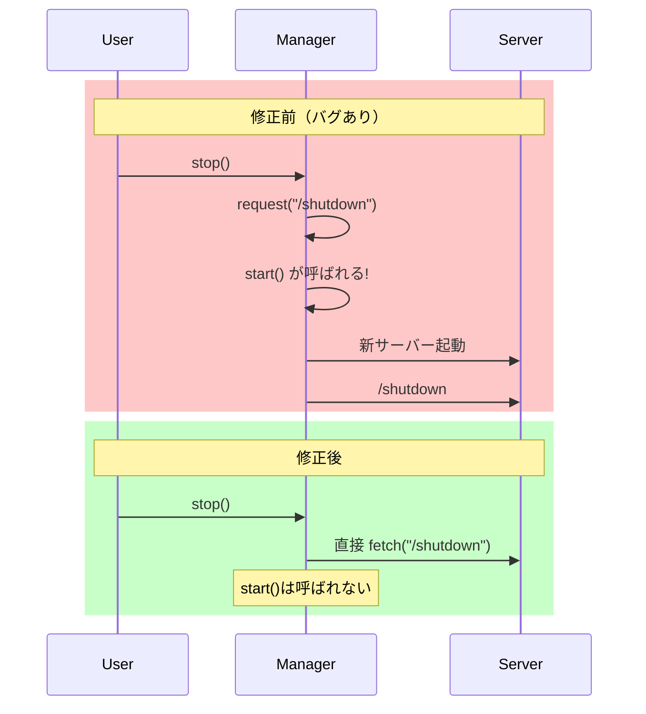
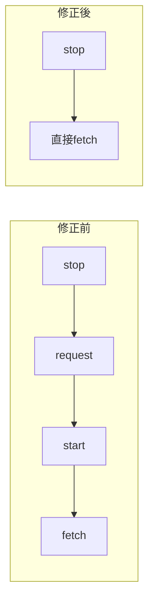
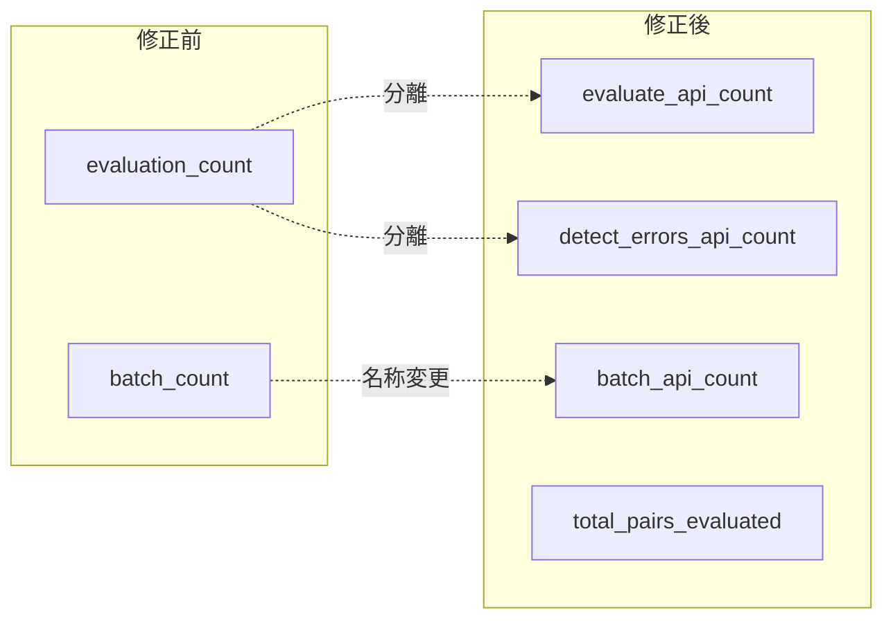
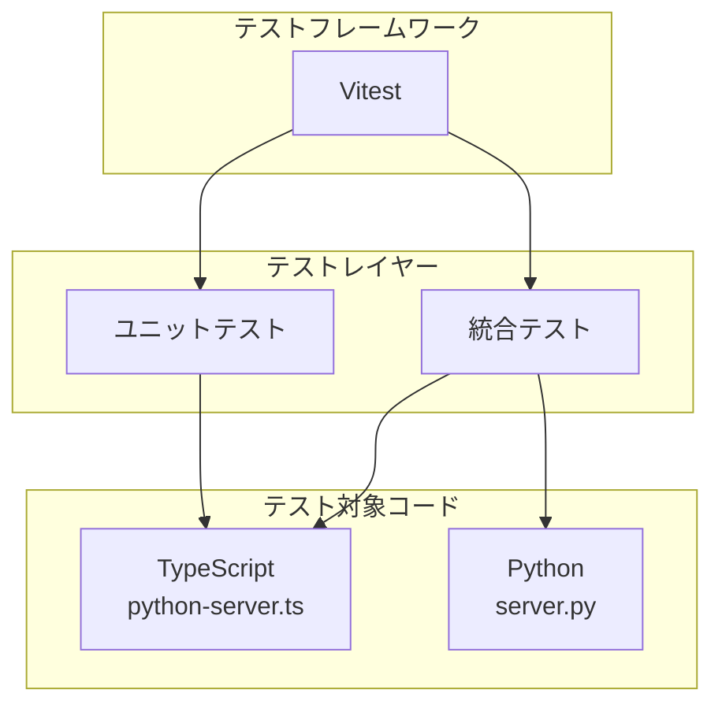

# xCOMET MCP Server テストドキュメント

このドキュメントでは、xCOMET MCP Server のテストスイートについて説明します。

## テスト概要



## テストファイル一覧

| ファイル | テスト数 | 種別 | 対象 |
|---------|---------|------|------|
| `line-buffer.test.ts` | 9 | ユニット | TypeScript |
| `stop-race-condition.test.ts` | 5 | ユニット | TypeScript |
| `integration.test.ts` | 5 | 統合 | Python + TypeScript |
| **合計** | **19** | - | - |

---

## 1. 行バッファリングテスト (`line-buffer.test.ts`)

### 問題の背景

Python サーバーはポート番号を JSON 形式で stdout に出力します。しかし、パイプバッファリングにより出力が複数チャンクに分割される可能性があります。



### テストケース

| テスト名 | 説明 |
|---------|------|
| `should parse complete JSON in single chunk` | 単一チャンクでの正常パース |
| `should handle JSON split across multiple chunks` | 複数チャンクに分割されたJSONの処理 |
| `should handle JSON with preceding log output` | ログ出力が先行する場合 |
| `should handle multiple lines in single chunk` | 1チャンクに複数行が含まれる場合 |
| `should handle chunk boundary in the middle of JSON` | JSON途中でのチャンク分割 |
| `should ignore incomplete JSON at end of stream` | 不完全なJSONの無視 |
| `should handle empty chunks` | 空チャンクの処理 |
| `should handle Windows-style line endings` | CRLF改行コードの処理 |
| `should handle no port in output` | ポート情報がない場合 |

### 行バッファリングアルゴリズム



---

## 2. stop() レース条件テスト (`stop-race-condition.test.ts`)

### 問題の背景

修正前の `stop()` メソッドは `request()` を経由して `/shutdown` を呼び出していました。`request()` は内部で `start()` を呼ぶため、停止処理中に新しいサーバーが起動する問題がありました。



### テストケース

| テスト名 | 説明 |
|---------|------|
| `fixed stop() should not call start() when server is running` | 実行中サーバー停止時にstart()が呼ばれない |
| `fixed stop() should not call start() when server is not running` | 未実行時にstart()が呼ばれない |
| `buggy stop() would call start() unnecessarily` | 修正前のバグ動作を確認 |
| `fixed stop() should handle missing port gracefully` | ポートなしでも安全に停止 |
| `fixed stop() should skip shutdown request when no process` | プロセスなしでスキップ |

### 修正のポイント



---

## 3. 統合テスト (`integration.test.ts`)

### テスト対象

実際の Python サーバーを起動して、エンドポイントの動作を検証します。

```mermaid
flowchart TD
    subgraph "統合テストフロー"
        A[Python サーバー起動] --> B[ポート取得]
        B --> C[エンドポイントテスト]
        C --> D[/health]
        C --> E[/stats]
        C --> F[/shutdown]
        D --> G[レスポンス検証]
        E --> G
        F --> G
        G --> H[サーバー停止]
    end
```

### テストケース

| テスト名 | 説明 |
|---------|------|
| `should start server and report port via stdout` | サーバー起動とポート報告 |
| `should respond to health check after startup` | ヘルスチェック応答 |
| `should return stats with new field names` | 新統計フィールドの確認 |
| `should shutdown gracefully via /shutdown endpoint` | グレースフルシャットダウン |
| `should have server.py in python directory` | server.py の存在確認 |

### 統計フィールドの変更



---

## テストの実行方法

### 全テスト実行

```bash
npm test
```

### ウォッチモードで実行

```bash
npm run test:watch
```

### 特定のテストファイルのみ実行

```bash
npx vitest run tests/line-buffer.test.ts
```

### カバレッジ付きで実行

```bash
npx vitest run --coverage
```

---

## テストの前提条件

### Node.js 側

- Node.js 18.0.0 以上
- `npm install` で依存関係をインストール済み

### Python 側（統合テスト用）

- Python 3.8 以上
- 以下のパッケージがインストール済み:
  - `fastapi`
  - `uvicorn`

```bash
pip install fastapi uvicorn
```

---

## テストアーキテクチャ



---

## CI/CD での実行

GitHub Actions などで実行する場合の例:

```yaml
- name: Run tests
  run: |
    npm ci
    pip install fastapi uvicorn
    npm test
```

---

## トラブルシューティング

### 統合テストがスキップされる

Python の依存関係がインストールされていない場合、統合テストは自動的にスキップされます。

```bash
# 依存関係をインストール
pip install fastapi uvicorn
```

### ポートが既に使用中のエラー

テストは毎回ランダムなポートを使用しますが、まれにポート競合が発生する場合があります。テストを再実行してください。

### タイムアウトエラー

サーバーの起動に時間がかかる環境では、`vitest.config.ts` の `testTimeout` を調整してください。
