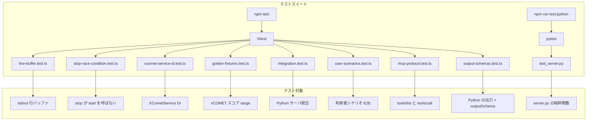
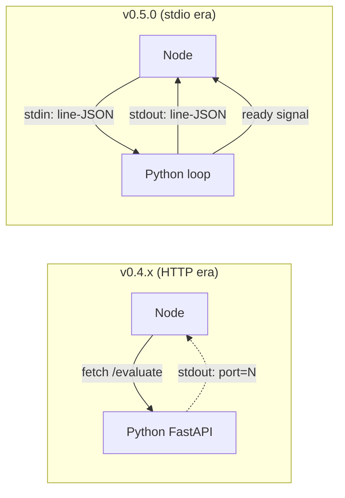
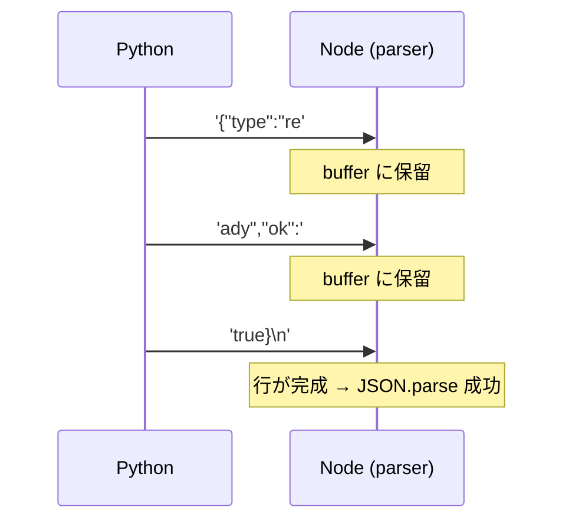
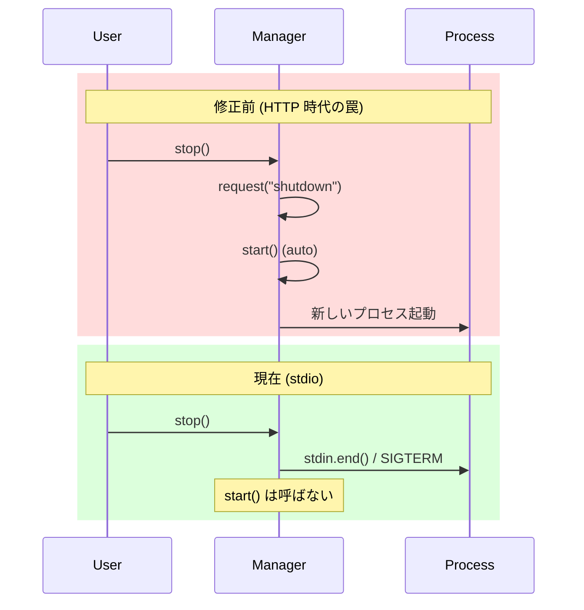
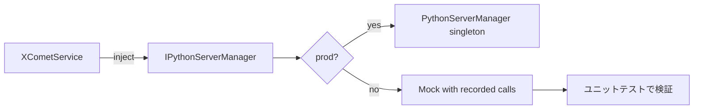
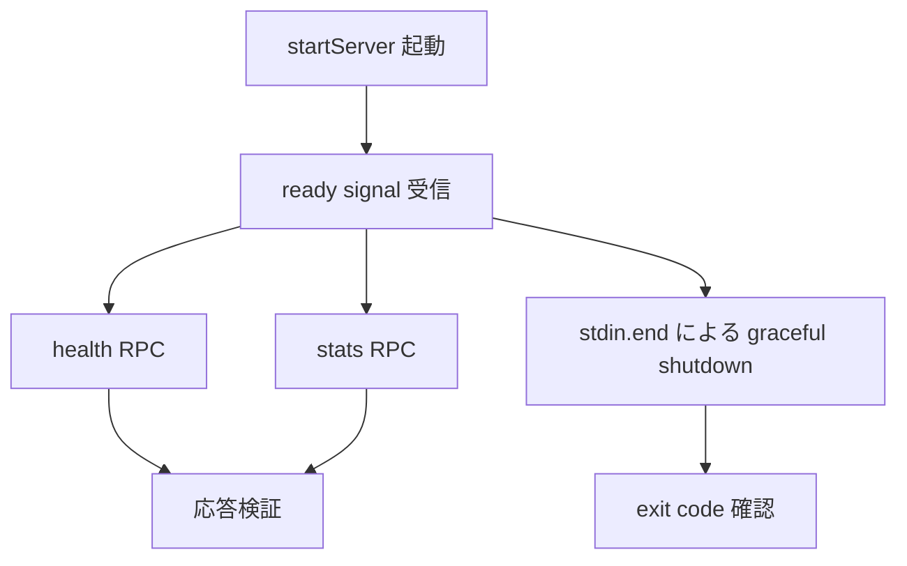
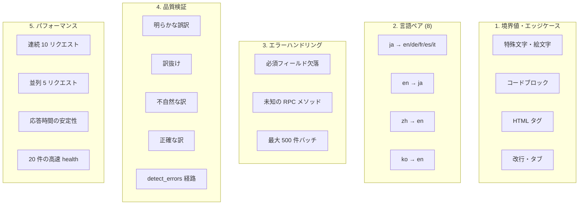
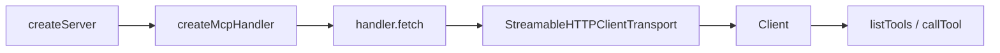
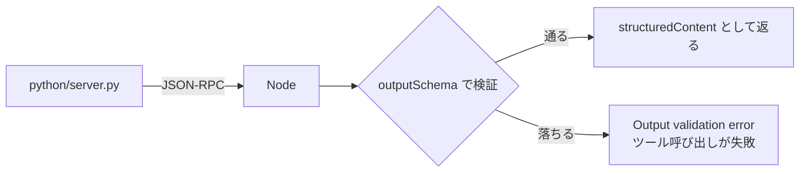

# xCOMET MCP Server テストドキュメント

このドキュメントでは、xCOMET MCP Server のテストスイートについて説明します（v0.5.0+ stdio JSON-RPC 構成）。

## テスト概要


```mermaid
graph TD
    subgraph "テストスイート"
        A[npm test] --> B[Vitest]
        B --> C[line-buffer.test.ts]
        B --> D[stop-race-condition.test.ts]
        B --> E[xcomet-service-di.test.ts]
        B --> F[golden-fixtures.test.ts]
        B --> G[integration.test.ts]
        B --> H[user-scenarios.test.ts]
        B --> I[mcp-protocol.test.ts]
        B --> J[output-schemas.test.ts]
        K[npm run test:python] --> L[pytest]
        L --> M[test_server.py]
    end

    subgraph "テスト対象"
        C --> C1[stdout 行バッファ]
        D --> D1[stop が start を呼ばない]
        E --> E1[XCometService DI]
        F --> F1[xCOMET スコア range]
        G --> G1[Python サーバ統合]
        H --> H1[利用者シナリオ E2E]
        I --> I1[tools/list と tools/call]
        J --> J1[Python の出力 × outputSchema]
        M --> M1[server.py の純粋関数]
    end
```

## テストファイル一覧

| ファイル | 区分 | 種別 | 実行コマンド | Python 必須 |
|---------|------|------|-------------|-------------|
| `line-buffer.test.ts` | ユニット | TypeScript | `npm test` | 不要 |
| `stop-race-condition.test.ts` | ユニット | TypeScript | `npm test` | 不要 |
| `xcomet-service-di.test.ts` | ユニット (DI) | TypeScript | `npm test` | 不要 |
| `mcp-protocol.test.ts` | プロトコル | TypeScript | `npm test` | 不要 |
| `output-schemas.test.ts` | 契約 | TypeScript | `npm test` | 不要 |
| `golden-fixtures.test.ts` | リグレッション | Python + TS | `npm test` | 必要（無ければ skip） |
| `integration.test.ts` | 統合 | Python + TS | `npm test` | 必要（無ければ skip） |
| `user-scenarios.test.ts` | E2E | Python + TS | `npm test` | 必要（無ければ skip） |
| `test_server.py` | ユニット | pytest | `npm run test:python` | **pytest のみ**（comet 不要） |

`comet` パッケージが未インストールの環境では Python 必須テストは自動スキップされます。
`test_server.py` は `npm test`（Vitest）には含まれません。別コマンドです。

---

## v0.5.0 で何が変わったか

v0.4.x までは Python サーバが FastAPI/uvicorn でローカル HTTP リスナーを立て、Node 側が `fetch()` で叩く構成でした。v0.5.0 で **stdio + 行区切り JSON-RPC** に切り替わったため、テスト群も次のとおり更新されています。


```mermaid
flowchart LR
    subgraph "v0.4.x (HTTP era)"
        A1[Node] -->|fetch /evaluate| A2[Python FastAPI]
        A2 -.->|stdout: port=N| A1
    end

    subgraph "v0.5.0 (stdio era)"
        B1[Node] -->|stdin: line-JSON| B2[Python loop]
        B2 -->|stdout: line-JSON| B1
        B2 -->|ready signal| B1
    end
```

- **ポート検出は廃止** — Python は `{"type":"ready","ok":true}` を一度だけ stdout に書く
- **`/shutdown` エンドポイント廃止** — Node が child の stdin を close（EOF）→ Python は readline ループを抜けて exit
- **stats フィールドは `*_rpc_count` 系**（旧 `*_api_count` は削除）

---

## 1. 行バッファリングテスト (`line-buffer.test.ts`)

### 問題の背景

stdio 上を流れるメッセージは「1 JSON object / 1 行」ですが、`stdout.on('data')` の chunk 境界は任意の位置で割れます。ここを安全に処理できているかを検証します。


```mermaid
sequenceDiagram
    participant P as Python
    participant N as Node (parser)

    P->>N: '{"type":"re'
    Note over N: buffer に保留
    P->>N: 'ady","ok":'
    Note over N: buffer に保留
    P->>N: 'true}\n'
    Note over N: 行が完成 → JSON.parse 成功
```

### テストケース

| テスト名 | 説明 |
|---------|------|
| `parses a ready message delivered in one chunk` | 単一チャンクで届く `ready` メッセージ |
| `handles a ready message split across multiple chunks` | チャンク分割された `ready` |
| `delivers multiple response messages from a single chunk` | 1 チャンクに複数の応答 |
| `interleaves ready and response messages in order` | `ready` と応答の順序保持 |
| `keeps a partial trailing line in the buffer` | 末尾の部分行をバッファに残す |
| `handles an empty chunk between messages` | 空チャンクの安全な処理 |
| `handles Windows-style line endings` | CRLF 改行 |
| `silently drops non-JSON lines on stdout` | 不正な行を無視 |
| `surfaces an error response when the server reports a failure` | `error` フィールドの伝播 |

---

## 2. stop() レース条件テスト (`stop-race-condition.test.ts`)

### 問題の背景

HTTP 時代の旧バグ：`stop()` が `request("/shutdown")` を呼び、`request()` が auto-start を経由して新しいプロセスを生んでいました。stdio 化後の現在は EOF + SIGTERM + SIGKILL fallback で停止しますが、**「stop は start を絶対に呼ばない」というインバリアントは引き続き成り立たせる必要がある** ため、バグった実装と正しい実装を対比して固定しています。


```mermaid
sequenceDiagram
    participant U as User
    participant M as Manager
    participant S as Process

    rect rgb(255, 220, 220)
        Note over U,S: 修正前 (HTTP 時代の罠)
        U->>M: stop()
        M->>M: request("shutdown")
        M->>M: start() (auto)
        M->>S: 新しいプロセス起動
    end

    rect rgb(220, 255, 220)
        Note over U,S: 現在 (stdio)
        U->>M: stop()
        M->>S: stdin.end() / SIGTERM
        Note over M: start() は呼ばない
    end
```

### テストケース

| テスト名 | 説明 |
|---------|------|
| `fixed stop() closes stdin and sends SIGTERM without re-starting` | 正しい挙動の検証 |
| `fixed stop() is a safe no-op when nothing is running` | プロセス無しでも安全 |
| `buggy stop() (for contrast) would restart the server unnecessarily` | 旧バグを反証として残す |

---

## 3. XCometService DI テスト (`xcomet-service-di.test.ts`)

### 設計意図

`IPythonServerManager` をモック注入することで、**Python プロセスを spawn せずに** XCometService の振る舞いを検証します。これにより CI（Python 無し）でもサービス層の主要パスをカバーできます。


```mermaid
flowchart LR
    A[XCometService] -->|inject| B[IPythonServerManager]
    B --> C{prod?}
    C -->|yes| D[PythonServerManager singleton]
    C -->|no| E[Mock with recorded calls]
    E --> F[ユニットテストで検証]
```

### テストケース

| テスト名 | 説明 |
|---------|------|
| `forwards evaluate parameters to the injected manager` | パラメータ転送 |
| `rejects evaluate without reference for WMT models` | reference 必須モデルの事前検証 |
| `forwards detectErrors parameters correctly` | detect_errors 経路 |
| `short-circuits batchEvaluate when pairs is empty` | 空配列で RPC を発生させない |
| `extends batch timeout proportionally to pair count` | バッチタイムアウト計算 |
| `validates batch reference requirement for WMT models` | バッチでの reference 検証 |
| `exposes python path and model from the injected manager` | 委譲メソッド |

---

## 4. Golden Fixtures (`golden-fixtures.test.ts`)

### 設計意図

xCOMET の出力はハードウェア・ライブラリバージョンで微妙に揺れるため、**完全一致ではなく `[score_min, score_max]` の範囲アサーション** で安定性とリグレッション検出を両立しています。

`tests/fixtures/golden.json` には good / fair / poor 各 3 件以上、計 20 件以上のケースが定義されています。

```mermaid
flowchart TD
    A[golden.json: 20+ cases] --> B{Python あり?}
    B -->|no| C[全ケース skip]
    B -->|yes| D[1 case ごとに 1 it]
    D --> E[evaluate RPC]
    E --> F{score in [min, max]?}
    F -->|yes| G[pass]
    F -->|no| H[fail with case id]
```

### メタテスト（Python 不要・常時実行）

| テスト名 | 説明 |
|---------|------|
| `fixture file parses` | JSON が読める |
| `contains at least 20 cases` | 規模の下限 |
| `every case has required fields` | スキーマ検証 |
| `has balanced quality distribution` | good/fair/poor の均衡 |

---

## 5. 統合テスト (`integration.test.ts`)

実際の Python サーバを spawn して、stdio JSON-RPC プロトコルの初期化・基本 RPC・シャットダウンを検証します。


```mermaid
flowchart TD
    A[startServer 起動] --> B[ready signal 受信]
    B --> C[health RPC]
    B --> D[stats RPC]
    B --> E[stdin.end による graceful shutdown]
    C --> F[応答検証]
    D --> F
    E --> G[exit code 確認]
```

### テストケース

| テスト名 | 説明 |
|---------|------|
| `should emit the ready signal on startup` | `{"type":"ready","ok":true}` の発行 |
| `should respond to the health RPC` | health の status/model_loaded/model_name |
| `should return stats with RPC-style field names` | `evaluate_rpc_count` 等の存在確認、旧 `*_api_count` の不在 |
| `should shutdown gracefully when stdin is closed` | EOF だけで終了する |
| `should reject unknown methods with an error response` | 未知メソッドのエラー返却 |
| `should have server.py in python directory` | スクリプト存在確認 |

---

## 6. 利用者シナリオテスト (`user-scenarios.test.ts`)

実利用に近い E2E。stdio JSON-RPC クライアント (`StdioRpcClient`) を介して xCOMET モデルを叩きます。


```mermaid
graph TD
    subgraph "1. 境界値・エッジケース"
        A1[特殊文字・絵文字]
        A2[コードブロック]
        A3[HTML タグ]
        A4[改行・タブ]
    end

    subgraph "2. 言語ペア (8)"
        B1[ja → en/de/fr/es/it]
        B2[en → ja]
        B3[zh → en]
        B4[ko → en]
    end

    subgraph "3. エラーハンドリング"
        C1[必須フィールド欠落]
        C2[未知の RPC メソッド]
        C3[最大 500 件バッチ]
    end

    subgraph "4. 品質検証"
        D1[明らかな誤訳]
        D2[訳抜け]
        D3[不自然な訳]
        D4[正確な訳]
        D5[detect_errors 経路]
    end

    subgraph "5. パフォーマンス"
        E1[連続 10 リクエスト]
        E2[並列 5 リクエスト]
        E3[応答時間の安定性]
        E4[20 件の高速 health]
    end
```

### スキップしているテスト

`describe.skipIf(!hasPythonDeps)` 経由で Python 不在環境では自動スキップされますが、Python ありの環境ではすべて実行されます。`it.skip` での恒久スキップは現在ありません（v0.5.x 以降）。

> **注記**: 以前あった `should handle empty strings gracefully` は v0.5.x の Python 側 `_require()` ヘルパ追加に伴い、`should reject empty strings with a clear error` として通常テストへ復帰しています。  
> `should handle very long text (1000+ characters)` は CPU 上で推論時間が読めないため、`tests/stress/long-text.stress.test.ts` に分離して `npm run test:stress` でのみ実行する設計になっています。

---

## 7. MCP プロトコルテスト (`mcp-protocol.test.ts`)

### 設計意図

`src/server.ts` の `createServer()` に対して、**本物の `Client` をプロセス内で繋いで** `tools/list` と `tools/call` を叩きます。`createMcpHandler` が返す `handler.fetch` を `StreamableHTTPClientTransport` の `fetch` オプションに渡すだけで、ポートもソケットもモックの transport も要りません。

このテストの対象は、**型検査でもユニットテストでも検出できない失敗**です。SDK v2 は Zod スキーマを JSON Schema に変換して `tools/list` の応答に載せますが、変換に失敗しても登録時には何も起きません。サーバーは起動し、接続も成功し、最初の `tools/list` だけがエラーを返します（v0.7.0 の zod 4 移行で、宣言レンジが zod 3 のままだとこうなります）。


```mermaid
flowchart LR
    A[createServer] --> B[createMcpHandler]
    B --> C[handler.fetch]
    C --> D[StreamableHTTPClientTransport]
    D --> E[Client]
    E --> F[listTools / callTool]
```

### テストケース

| テスト名 | 説明 |
|---------|------|
| `advertises all three tools with converted JSON Schemas` | `tools/list` が 3 ツールを `inputSchema` / `outputSchema` 付きで返す |
| `keeps .describe() text in the advertised input schema` | `.describe()` の説明文が JSON Schema に残る（zod 4.2 未満だと消える） |
| `rejects arguments the schema refuses before the handler runs` | スキーマ違反が `isError: true` で返り、ハンドラに到達しない |
| `accepts an isError result with no structuredContent on a tool that declares outputSchema` | `createErrorResponse` の経路が v2 で通ることの確認 |

---

## 8. 出力スキーマ契約テスト (`output-schemas.test.ts`)

### 設計意図

MCP SDK は `structuredContent` を `outputSchema` で検証してから返します。**Python ワーカーが送るフィールドがスキーマと 1 つでも食い違うと、ツール呼び出しそのものが失敗します**。Node 側のユニットテストは Python の出力を知らず、Python 側のテストはスキーマを知らないため、この境界はどちらのテストの対象にもなりません。

v0.7.0 で実際に踏んだのがこれでした。`handle_detect_errors` が全エラーに `suggestion: None` を差し込む一方、スキーマは `z.string().optional()` を宣言していました。zod の `.optional()` が受けるのは `undefined` であって `null` ではないため、エラーが 1 件でもある `xcomet_detect_errors` はすべて失敗します。エラースパンが常に空だったせいで 4 リリース発火しませんでした。


```mermaid
flowchart LR
    A[python/server.py] -->|JSON-RPC| B[Node]
    B --> C{outputSchema で検証}
    C -->|通る| D[structuredContent として返る]
    C -->|落ちる| E["Output validation error<br/>ツール呼び出しが失敗"]
```

ペイロードは XCOMET-XL を実際に動かして採取した実測値で、手書きの例ではありません。

### テストケース

| テスト名 | 説明 |
|---------|------|
| `xcomet_evaluate: a result carrying an error span` | スパンありの実測ペイロード |
| `xcomet_evaluate: a result with no error spans` | スパンなしの実測ペイロード |
| `xcomet_detect_errors: a result carrying an error span` | 重大度カウントを含む実測ペイロード |
| `xcomet_detect_errors: an empty-text span is still a valid span` | COMET が返す幅ゼロのスパン（未翻訳の日本語が混ざった訳文で発生） |
| `xcomet_detect_errors: a null suggestion is rejected` | `suggestion` が復活しても null が wire に出ないことの固定 |
| `xcomet_batch_evaluate: mixed results, some with spans` | 5 件混在の実測ペイロード |
| `rejects a severity the MQM label set does not define` | 未定義の重大度を弾く |

---

## 9. Python ユニットテスト (`test_server.py`)

### 設計意図

`python/server.py` のうち、**COMET の予測構造体を読み解く部分**を検証します。ここを間違えても、目に見える失敗にはなりません。サーバーは応答し続け、スコアも正しく、エラースパンだけが空になります。Node 側の統合テストは、正常な応答として受け取ります。実際に v0.3.4 から 0.6.3 まで、`output.metadata[0]` の誤りでスパンが常に空でした。

COMET の `Prediction` は自前の `ModelOutput`（旧 transformers のコピー、`comet/models/utils.py:23`）を継承していて、`__getitem__` は str 以外のキーで `to_tuple()[k]`、つまり値の側を引きます。

```python
metadata = Prediction(src_scores=[...], mqm_scores=[...], error_spans=[[...]])

metadata[0]               # → src_scores。サンプル 0 のデータではない
len(metadata)             # → 3。サンプル数ではなくキー数
metadata["error_spans"]   # → サンプルごとのスパンのリスト（正しい引き方）
```

テストはこの `ModelOutput` の挙動を写した最小クラスを用意して、`_error_spans` に通します。**pytest だけで実行でき、`comet` も torch もモデルも要りません。**

### テストケース

| テスト名 | 説明 |
|---------|------|
| `test_indexing_metadata_by_position_returns_the_wrong_thing` | 修正が前提としている挙動そのものを固定。将来 COMET 側が直れば失敗して気付ける |
| `test_error_spans_are_returned_per_sample` | サンプルごとに正しいスパンが返る |
| `test_confidence_is_dropped` | 出力スキーマにある 4 フィールドだけを返す |
| `test_index_past_the_last_sample_is_empty` | 範囲外インデックス |
| `test_reference_branch_has_five_metadata_keys` | 参照ありの分岐（キーが 5 つ） |
| `test_model_without_metadata_yields_no_spans` | 回帰モデル（`wmt22-comet-da`）は metadata を持たない |
| `test_metadata_without_error_spans_yields_no_spans` | `error_spans` キーが無い場合 |
| `test_missing_span_fields_fall_back` | スパンのフィールド欠落時の既定値 |
| `test_model_requires_reference_is_an_exact_match` | 完全一致判定（部分一致では拾わない）※パラメータ化 4 件 |
| `test_num_workers_falls_back_to_one` | `XCOMET_NUM_WORKERS` の下限と不正値 ※パラメータ化 7 件 |
| `test_local_files_only_flag` | `XCOMET_LOCAL_FILES_ONLY` の真偽値解釈 ※パラメータ化 7 件 |
| `test_saving_directory_expands_home` | `XCOMET_SAVING_DIRECTORY` の `~` 展開と空文字 |

---

## テストの実行方法

### 全テスト実行

```bash
npm test
```

### ウォッチモードで実行

```bash
npm run test:watch
```

### 特定のテストファイルのみ実行

```bash
npx vitest run tests/line-buffer.test.ts
```

### カバレッジ付きで実行

```bash
npx vitest run --coverage
```

### Python 側のユニットテスト

Vitest とは別コマンドです。`comet` もモデルも不要で、**pytest だけ**あれば実行できます。

```bash
npm run test:python
```

`npm run test:python` は `python3 -m pytest` を呼ぶだけなので、PATH 上の `python3` に
pytest が入っていなければ `No module named pytest` になります。入れ方はいくつかあります。

```bash
# uv があるなら（インストール不要、その場限りの環境で実行）
uvx pytest tests/test_server.py -q

# xCOMET 用の venv に入れてしまう
~/.xcomet-venv/bin/python -m pip install pytest
~/.xcomet-venv/bin/python -m pytest tests/test_server.py -q

# 開発用の venv を新しく作る
python3 -m venv .venv-dev && .venv-dev/bin/pip install pytest
.venv-dev/bin/python -m pytest tests/test_server.py -q
```

---

## テストの前提条件

### Node.js 側

- Node.js >= 22.0.0
- `npm install` で依存関係をインストール済み

### Python 側（統合・E2E・golden テスト用）

- Python 3.9〜3.12（`unbabel-comet` が `numpy <2.0` を固定しており、numpy 1.x の
  最終版 1.26.4 の wheel が cp39-cp312 しかないため）
- `unbabel-comet>=2.2.7,<3.0`

```bash
pip install "unbabel-comet>=2.2.7,<3.0"
```

### Python 側（`test_server.py` 用）

- pytest のみ。`comet` も torch もモデルも不要で、実行は 0.03 秒程度です。
- Python のバージョン制約もありません（3.9 以降であれば実行できます）。

> **注記（v0.5.0 以降）**: Python ワーカーは stdio JSON-RPC で通信するため、
> FastAPI / uvicorn / pydantic は不要です。

---

## CI/CD での実行

GitHub Actions は 2 系統に分かれています。Python ありのフルスイート（golden / integration /
user-scenarios）はモデルのダウンロードを伴うため、ローカルまたは GPU ランナーでの実行を想定しています。

```yaml
# Vitest: Python なしで走る分（line-buffer / stop-race / DI / protocol /
# output-schemas / golden meta）。matrix で Node 22 と 24。
- name: Run tests
  run: npm test

# pytest: test_server.py。pytest だけ入れれば動く。
- name: Install pytest
  run: python -m pip install --upgrade pytest
- name: Run Python tests
  run: npm run test:python
```

`publish.yml`（タグ push 時）は lint → test → build → publish の順で、`test:python` は
含みません。Python 側の検証は `ci.yml` の `python-tests` ジョブが担当します。

---

## トラブルシューティング

### 統合テストがスキップされる

Python の `comet` モジュールが import できない環境では、`describe.skipIf(!hasPythonDeps)` で自動的にスキップされます。

```bash
pip install "unbabel-comet>=2.2.0"
```

### `npm run test:python` が `No module named pytest` で落ちる

`test:python` は PATH 上の `python3` を使います。xCOMET 用の venv を activate しても、
その venv に pytest が入っていなければ同じエラーになります。上の
[Python 側のユニットテスト](#python-側のユニットテスト)にある 3 通りのいずれかで入れてください。

### タイムアウトエラー

初回モデルロード（25-90 秒）を含むため、`vitest.config.ts` の `testTimeout` または個別 `it` の第3引数で延長してください。
