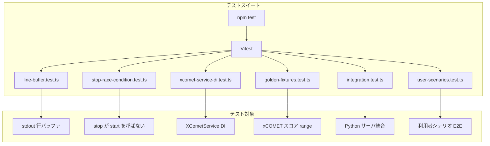
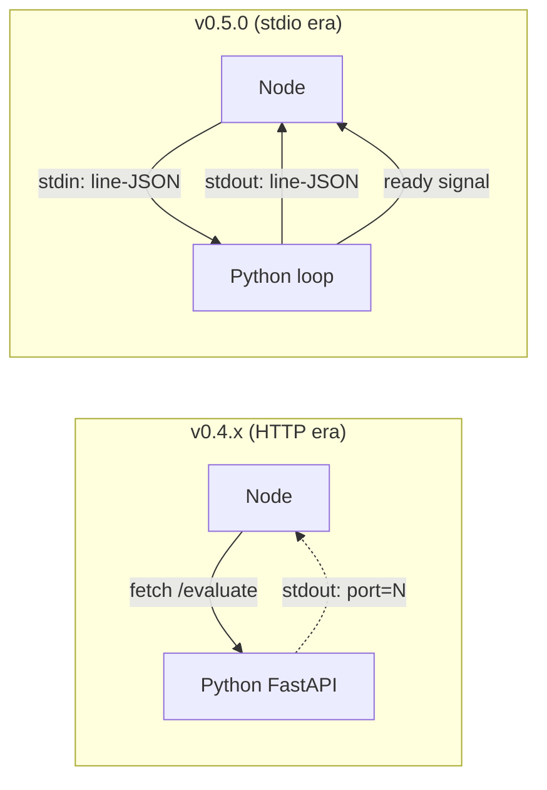
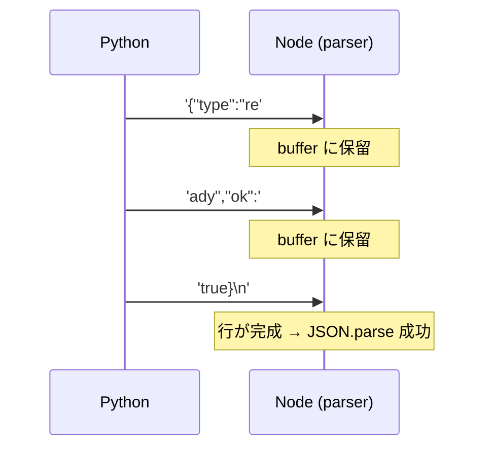
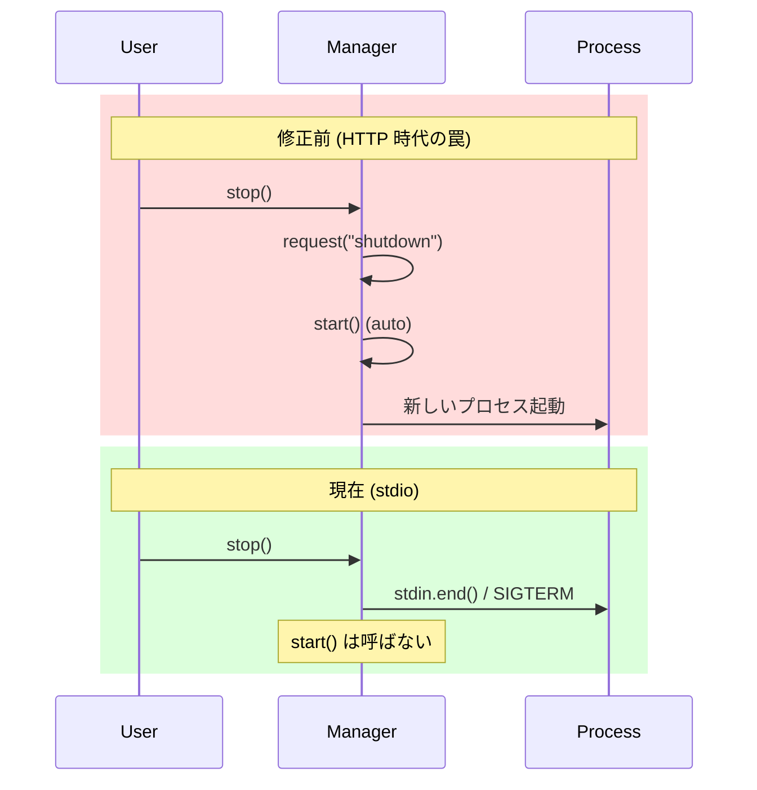
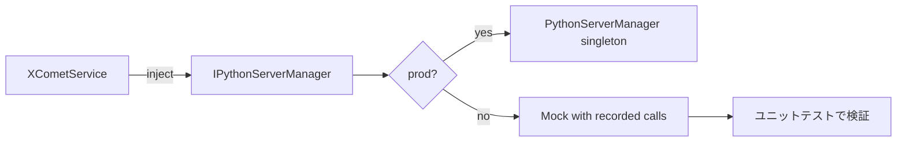
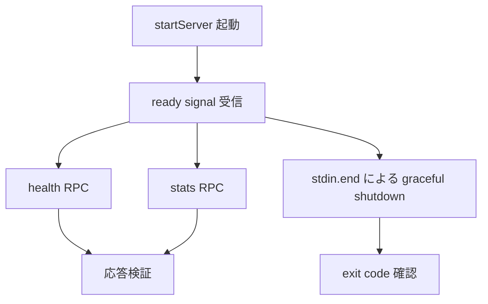
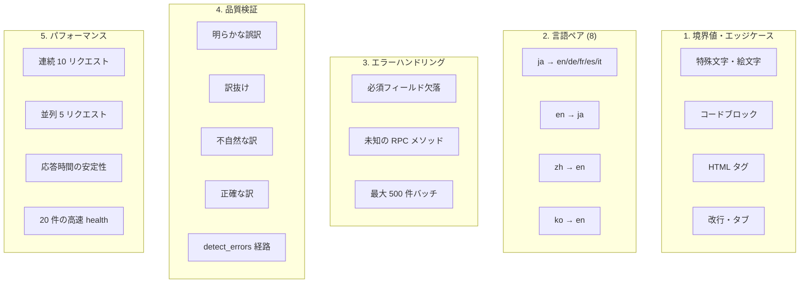

# xCOMET MCP Server テストドキュメント

このドキュメントでは、xCOMET MCP Server のテストスイートについて説明します（v0.5.0+ stdio JSON-RPC 構成）。

## テスト概要


```mermaid
graph TD
    subgraph "テストスイート"
        A[npm test] --> B[Vitest]
        B --> C[line-buffer.test.ts]
        B --> D[stop-race-condition.test.ts]
        B --> E[xcomet-service-di.test.ts]
        B --> F[golden-fixtures.test.ts]
        B --> G[integration.test.ts]
        B --> H[user-scenarios.test.ts]
    end

    subgraph "テスト対象"
        C --> C1[stdout 行バッファ]
        D --> D1[stop が start を呼ばない]
        E --> E1[XCometService DI]
        F --> F1[xCOMET スコア range]
        G --> G1[Python サーバ統合]
        H --> H1[利用者シナリオ E2E]
    end
```

## テストファイル一覧

| ファイル | 区分 | 種別 | Python 必須 |
|---------|------|------|-------------|
| `line-buffer.test.ts` | ユニット | TypeScript | 不要 |
| `stop-race-condition.test.ts` | ユニット | TypeScript | 不要 |
| `xcomet-service-di.test.ts` | ユニット (DI) | TypeScript | 不要 |
| `golden-fixtures.test.ts` | リグレッション | Python + TS | 必要（無ければ skip） |
| `integration.test.ts` | 統合 | Python + TS | 必要（無ければ skip） |
| `user-scenarios.test.ts` | E2E | Python + TS | 必要（無ければ skip） |

`comet` パッケージが未インストールの環境では Python 必須テストは自動スキップされます。

---

## v0.5.0 で何が変わったか

v0.4.x までは Python サーバが FastAPI/uvicorn でローカル HTTP リスナーを立て、Node 側が `fetch()` で叩く構成でした。v0.5.0 で **stdio + 行区切り JSON-RPC** に切り替わったため、テスト群も以下の通り更新されています。


```mermaid
flowchart LR
    subgraph "v0.4.x (HTTP era)"
        A1[Node] -->|fetch /evaluate| A2[Python FastAPI]
        A2 -.->|stdout: port=N| A1
    end

    subgraph "v0.5.0 (stdio era)"
        B1[Node] -->|stdin: line-JSON| B2[Python loop]
        B2 -->|stdout: line-JSON| B1
        B2 -->|ready signal| B1
    end
```

- **ポート検出は廃止** — Python は `{"type":"ready","ok":true}` を一度だけ stdout に書く
- **`/shutdown` エンドポイント廃止** — Node が child の stdin を close（EOF）→ Python は readline ループを抜けて exit
- **stats フィールドは `*_rpc_count` 系**（旧 `*_api_count` は削除）

---

## 1. 行バッファリングテスト (`line-buffer.test.ts`)

### 問題の背景

stdio 上を流れるメッセージは「1 JSON object / 1 行」ですが、`stdout.on('data')` の chunk 境界は任意の位置で割れます。ここを安全に処理できているかを検証します。


```mermaid
sequenceDiagram
    participant P as Python
    participant N as Node (parser)

    P->>N: '{"type":"re'
    Note over N: buffer に保留
    P->>N: 'ady","ok":'
    Note over N: buffer に保留
    P->>N: 'true}\n'
    Note over N: 行が完成 → JSON.parse 成功
```

### テストケース

| テスト名 | 説明 |
|---------|------|
| `parses a ready message delivered in one chunk` | 単一チャンクの `ready` 信号 |
| `handles a ready message split across multiple chunks` | チャンク分割された `ready` |
| `delivers multiple response messages from a single chunk` | 1 チャンクに複数レスポンス |
| `interleaves ready and response messages in order` | `ready` とレスポンスの順序保持 |
| `keeps a partial trailing line in the buffer` | 末尾の部分行をバッファに残す |
| `handles an empty chunk between messages` | 空チャンクの安全な処理 |
| `handles Windows-style line endings` | CRLF 改行 |
| `silently drops non-JSON lines on stdout` | 不正な行を無視 |
| `surfaces an error response when the server reports a failure` | `error` フィールドの伝播 |

---

## 2. stop() レース条件テスト (`stop-race-condition.test.ts`)

### 問題の背景

HTTP 時代の旧バグ：`stop()` が `request("/shutdown")` を呼び、`request()` が auto-start を経由して新しいプロセスを生んでいました。stdio 化後の現在は EOF + SIGTERM + SIGKILL fallback で停止しますが、**「stop は start を絶対に呼ばない」というインバリアントは引き続き守る必要がある** ため、バグった実装と正しい実装を対比して固定しています。


```mermaid
sequenceDiagram
    participant U as User
    participant M as Manager
    participant S as Process

    rect rgb(255, 220, 220)
        Note over U,S: 修正前 (HTTP 時代の罠)
        U->>M: stop()
        M->>M: request("shutdown")
        M->>M: start() (auto)
        M->>S: 新しいプロセス起動
    end

    rect rgb(220, 255, 220)
        Note over U,S: 現在 (stdio)
        U->>M: stop()
        M->>S: stdin.end() / SIGTERM
        Note over M: start() は呼ばない
    end
```

### テストケース

| テスト名 | 説明 |
|---------|------|
| `fixed stop() closes stdin and sends SIGTERM without re-starting` | 正しい挙動の検証 |
| `fixed stop() is a safe no-op when nothing is running` | プロセス無しでも安全 |
| `buggy stop() (for contrast) would restart the server unnecessarily` | 旧バグを反証として残す |

---

## 3. XCometService DI テスト (`xcomet-service-di.test.ts`)

### 設計意図

`IPythonServerManager` をモック注入することで、**Python プロセスを spawn せずに** XCometService の振る舞いを検証します。これにより CI（Python 無し）でもサービス層の主要パスをカバーできます。


```mermaid
flowchart LR
    A[XCometService] -->|inject| B[IPythonServerManager]
    B --> C{prod?}
    C -->|yes| D[PythonServerManager singleton]
    C -->|no| E[Mock with recorded calls]
    E --> F[ユニットテストで検証]
```

### テストケース

| テスト名 | 説明 |
|---------|------|
| `forwards evaluate parameters to the injected manager` | パラメータ転送 |
| `rejects evaluate without reference for WMT models` | reference 必須モデルの事前検証 |
| `forwards detectErrors parameters correctly` | detect_errors 経路 |
| `short-circuits batchEvaluate when pairs is empty` | 空配列で RPC を発生させない |
| `extends batch timeout proportionally to pair count` | バッチタイムアウト計算 |
| `validates batch reference requirement for WMT models` | バッチでの reference 検証 |
| `exposes python path and model from the injected manager` | 委譲メソッド |

---

## 4. Golden Fixtures (`golden-fixtures.test.ts`)

### 設計意図

xCOMET の出力はハードウェア・ライブラリバージョンで微妙に揺れるため、**完全一致ではなく `[score_min, score_max]` の範囲アサーション** で安定性とリグレッション検出を両立しています。

`tests/fixtures/golden.json` には good / fair / poor 各 3 件以上、計 20 件以上のケースが定義されています。

```mermaid
flowchart TD
    A[golden.json: 20+ cases] --> B{Python あり?}
    B -->|no| C[全ケース skip]
    B -->|yes| D[1 case ごとに 1 it]
    D --> E[evaluate RPC]
    E --> F{score in [min, max]?}
    F -->|yes| G[pass]
    F -->|no| H[fail with case id]
```

### メタテスト（Python 不要・常時実行）

| テスト名 | 説明 |
|---------|------|
| `fixture file parses` | JSON が読める |
| `contains at least 20 cases` | 規模の下限 |
| `every case has required fields` | スキーマ検証 |
| `has balanced quality distribution` | good/fair/poor の均衡 |

---

## 5. 統合テスト (`integration.test.ts`)

実際の Python サーバを spawn して、stdio JSON-RPC プロトコルの初期化・基本 RPC・シャットダウンを検証します。


```mermaid
flowchart TD
    A[startServer 起動] --> B[ready signal 受信]
    B --> C[health RPC]
    B --> D[stats RPC]
    B --> E[stdin.end による graceful shutdown]
    C --> F[応答検証]
    D --> F
    E --> G[exit code 確認]
```

### テストケース

| テスト名 | 説明 |
|---------|------|
| `should emit the ready signal on startup` | `{"type":"ready","ok":true}` の発行 |
| `should respond to the health RPC` | health の status/model_loaded/model_name |
| `should return stats with RPC-style field names` | `evaluate_rpc_count` 等の存在確認、旧 `*_api_count` の不在 |
| `should shutdown gracefully when stdin is closed` | EOF だけで終了する |
| `should reject unknown methods with an error response` | 未知メソッドのエラー返却 |
| `should have server.py in python directory` | スクリプト存在確認 |

---

## 6. 利用者シナリオテスト (`user-scenarios.test.ts`)

実利用に近い E2E。stdio JSON-RPC クライアント (`StdioRpcClient`) を介して xCOMET モデルを叩きます。


```mermaid
graph TD
    subgraph "1. 境界値・エッジケース"
        A1[特殊文字・絵文字]
        A2[コードブロック]
        A3[HTML タグ]
        A4[改行・タブ]
    end

    subgraph "2. 言語ペア (8)"
        B1[ja → en/de/fr/es/it]
        B2[en → ja]
        B3[zh → en]
        B4[ko → en]
    end

    subgraph "3. エラーハンドリング"
        C1[必須フィールド欠落]
        C2[未知の RPC メソッド]
        C3[最大 500 件バッチ]
    end

    subgraph "4. 品質検証"
        D1[明らかな誤訳]
        D2[訳抜け]
        D3[不自然な訳]
        D4[正確な訳]
        D5[detect_errors 経路]
    end

    subgraph "5. パフォーマンス"
        E1[連続 10 リクエスト]
        E2[並列 5 リクエスト]
        E3[応答時間の安定性]
        E4[20 件の高速 health]
    end
```

### スキップしているテスト

`describe.skipIf(!hasPythonDeps)` 経由で Python 不在環境では自動スキップされますが、Python ありの環境ではすべて実行されます。`it.skip` での恒久スキップは現在ありません（v0.5.x 以降）。

> **Note**: 以前あった `should handle empty strings gracefully` は v0.5.x の Python 側 `_require()` ヘルパ追加に伴い、`should reject empty strings with a clear error` として通常テストへ復帰しています。  
> `should handle very long text (1000+ characters)` は CPU 上で推論時間が読めないため、`tests/stress/long-text.stress.test.ts` に分離して `npm run test:stress` でのみ実行する設計になっています。

---

## テストの実行方法

### 全テスト実行

```bash
npm test
```

### ウォッチモードで実行

```bash
npm run test:watch
```

### 特定のテストファイルのみ実行

```bash
npx vitest run tests/line-buffer.test.ts
```

### カバレッジ付きで実行

```bash
npx vitest run --coverage
```

---

## テストの前提条件

### Node.js 側

- Node.js >= 22.0.0
- `npm install` で依存関係をインストール済み

### Python 側（統合・E2E・golden テスト用）

- Python 3.9 - 3.12（xCOMET 依存の都合）
- `unbabel-comet>=2.2.0`

```bash
pip install "unbabel-comet>=2.2.0"
```

> **Note (v0.5.0+)**: Python ワーカーは stdio JSON-RPC で通信するため、
> FastAPI / uvicorn / pydantic は不要です。

---

## CI/CD での実行

GitHub Actions では Python なしのスモーク（line-buffer / stop-race / DI / golden meta）のみ走らせています。Python ありのフルスイートはローカルまたは GPU ランナーでの実行を想定。

```yaml
- name: Run tests (no Python)
  run: |
    npm ci
    npm test
```

---

## トラブルシューティング

### 統合テストがスキップされる

Python の `comet` モジュールが import できない環境では、`describe.skipIf(!hasPythonDeps)` で自動的にスキップされます。

```bash
pip install "unbabel-comet>=2.2.0"
```

### タイムアウトエラー

初回モデルロード（25-90 秒）を含むため、`vitest.config.ts` の `testTimeout` または個別 `it` の第3引数で延長してください。
